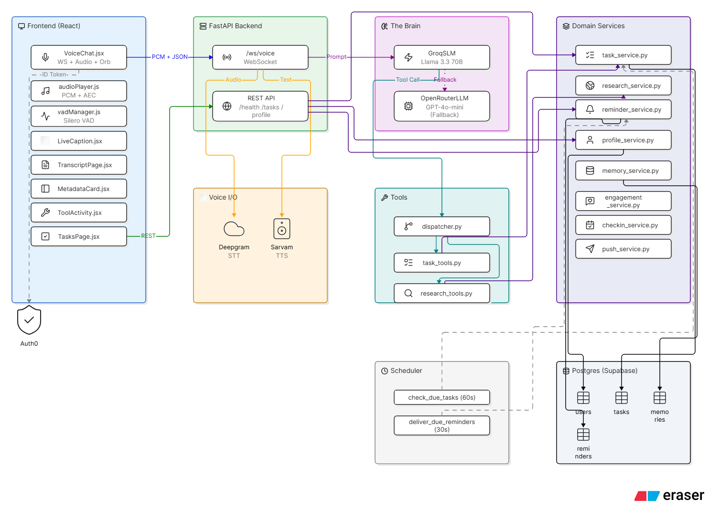

# Taskade — Voice-First AI Task Manager

Taskade is a personal assistant you talk to instead of type into. You speak naturally, it figures out what you actually want, and depending on the request it either answers you directly or goes and does something — creates a task, looks something up on the web, checks what's on your plate today. It remembers things about you across conversations, so you don't have to repeat yourself, and it can remind you when something's due. It's built to be usable by anyone for everyday life, not just a developer demo — the same way you'd ask a person to remind you to call someone or look something up for you.

## Demo [CLICK TO WATCH]

- **Live backend:** https://soge2020-taskade-backend.hf.space
- **Voice pipeline:** Deepgram Nova-3 (STT) + Sarvam Bulbul (TTS), streaming both ways
- **Brain:** Groq, running Llama 3.3 70B via an OpenAI-compatible endpoint — the single model that reasons, decides, and calls tools directly. OpenRouter (GPT-4o-mini) is a structural fallback for when Groq's tool-calling glitches, plus the separate model call behind web research and background memory extraction
- **Memory:** a plain `user_memories` table on Postgres — one LLM call extracts durable facts from every few turns and stores them as flat text rows; no vector DB or knowledge graph today (see `docs/db_revamp.md` for why that was deliberately simplified back from a richer design)
- **Auth / DB / Backend / Frontend:** Auth0 (Google sign-in) · Postgres (Supabase) · FastAPI · React
- **Deployment:** a GitHub Actions workflow pushes straight to the Hugging Face Space on every push to `main` using a publihs.yml file, no manual deploy step

## System design

## How a conversation actually works

When you speak, the audio streams to the backend over a single WebSocket connection and gets transcribed live by Deepgram. Deepgram also figures out when you've stopped talking using semantic endpointing, so there's no button to press and no awkward pause where the mic is still waiting on you.

Once your sentence is final, it goes to the brain — a Llama 3.3 70B model hosted on Groq, reached through an OpenAI-compatible endpoint. The brain reads what you said along with a slice of memory about you and your current tasks, and decides one of two things: either it can just answer you directly, or it needs to take an action first. If it needs to act, it calls a tool — create a task, look something up, check your task list, update something's status — reads the result back, and then responds in plain speech based on what it found. This can chain: research a topic, then use what it found to create a task with the right details already filled in.

As soon as a full sentence of the response is ready it's handed to text-to-speech and starts playing, while the model is still generating the rest of the answer. That's what makes the conversation feel continuous instead of "type, wait, get a wall of text read aloud." You can also just talk over the assistant mid-response and it stops immediately and listens to you instead — barge-in works the way it would with a person.

## The tools it has access to

The brain doesn't do everything itself — it calls a small set of tools when a request needs an actual action rather than just an answer. It can create a task (a simple reminder or a bigger multi-step goal), look up your existing tasks by status or date, mark something done or cancelled, and research something on the live web when the answer needs current information rather than what the model already knows. When research turns up something useful — an event date, a registration link — that gets attached to the task it creates, so you don't lose the context later.

Tasks themselves aren't flat. A task can have sub-tasks under it, and separately, a task can depend on another one finishing first — so "register for the marathon" can block "book the hotel" until registration is actually done, and finishing the first one automatically unblocks the second.

## Memory

There's a difference between what the assistant remembers for the length of one conversation and what it actually retains about you long-term, and the system treats those separately. The conversation itself — what you just said, what it just replied — stays in context for that session so the exchange feels coherent. Separately, every few turns a background call extracts durable facts worth keeping (your location, things you're working toward, preferences you've expressed) and stores them as plain text rows in Postgres, which get pulled back into the prompt on later turns when relevant. This is a deliberately simple flat store, not a vector database or knowledge graph — a richer version with entity/relationship tracking was built and then removed (see `docs/db_revamp.md`) because it added real per-turn cost for very little practical benefit at this scale.

## Reminders

Reminders are split into two halves that don't talk to each other. One half just checks, on a fixed interval, whether anything is due — it doesn't send anything, it just knows. The other half is what actually delivers a reminder, and it only runs when something asks it to (the web client polling every 60 seconds, for instance). Delivery and marking-as-delivered happen in the same atomic step, so a reminder can't get shown twice or silently dropped between the two halves. Splitting it this way was a deliberate choice after realizing that letting both halves mark things as delivered independently risked losing reminders.

There's a second, more elaborate reminder mechanism underneath this — a full per-offset delivery ledger with retry/claim semantics, built for push notifications — but it's currently dormant: there's no mobile app or push credentials configured yet, so nothing consumes it. The polling path above is what actually reaches the user today.

## What's running under the hood

Speech-to-text is Deepgram Nova-3, chosen mainly for server-side endpointing that actually feels natural. Text-to-speech is Sarvam Bulbul's streaming synthesis. The reasoning model is Llama 3.3 70B on Groq, reached through an OpenAI-compatible endpoint so the same client code works for it and for OpenRouter, which handles web research, the tool-calling fallback, and background memory extraction separately from the main conversational path. Everything durable — tasks, profiles, memory, reminders — lives in Postgres on Supabase. Auth is Auth0 with Google sign-in; sessions persist across reloads using a refresh token rather than a re-login every time. The backend is FastAPI, the frontend is a React app that currently exists as a working test harness for the backend rather than the final mobile app, which is planned separately.

## Branches

`main` is the active, working version described above. `mem0-implementation` is an older branch (last touched 2026-07-10) that swaps the memory layer for mem0 with real vector embeddings — it predates the memory/task/reminder simplification documented in `docs/db_revamp.md` and everything since, so it's now well behind `main` rather than a drop-in merge candidate. Treat it as reference material for the vector-memory approach, not a ready branch.

## Where to read more

The docs folder has the deeper technical writeups if you want them: `system_explanation.md` walks through the backend service by service, `frontend_explanation.md` does the same for the React client, `architecture_overview.md` has a full diagram of how everything connects, and `recent_changes.md` is a running log of what broke and why things ended up built the way they are.
