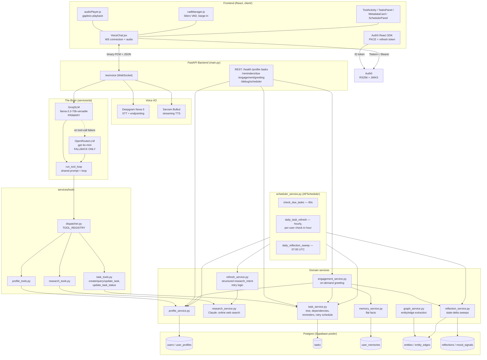

# Architecture Overview

A holistic, diagram-oriented map of the entire system — every service, how they're
interconnected, and how each individual process runs end to end. Written to support
building a system architecture diagram; for narrative "why" history see
`recent_changes.md`, and for the original backend/frontend deep-dives see
`system_explanation.md` / `frontend_explanation.md`.

## Mental model, in one paragraph

A FastAPI backend exposes **one WebSocket** (the entire voice conversation) and **seven
REST endpoints** (auth-gated CRUD/debug surfaces for the same data). One model — a
Groq-hosted Llama 3.3 70B — is the sole conversational brain: it reasons, decides, and
calls tools directly against Postgres. A second model (OpenRouter/gpt-4o-mini) exists
only as a structural twin, invoked solely when Groq's tool-calling glitches. A separate,
narrower model call handles web research. Everything else — auth, memory, the task
graph, the scheduler, engagement greetings — is plain deterministic Python/SQL feeding
context into that one model's prompt, not separate "agents."

---

## Architecture diagram (Mermaid)

---

## Backend, package by package

### `main.py` — the orchestrator
Owns the WebSocket lifecycle, the REST endpoints, the FastAPI `lifespan` (calls
`init_db()` then `start_scheduler()` on boot), and the per-turn pipeline
(`run_voice_pipeline`). This is the only file that wires every other package together
— nothing else imports from `main.py`.

### `core/config.py` — settings
One `Settings` class, env-driven, loaded once at import. Groups: Sarvam (legacy STT,
see below), Deepgram, Groq, OpenRouter (LLM + research model, currently
`anthropic/claude-sonnet-4.6:online`), Auth0, `DATABASE_URL`, scheduler/memory tuning,
server host/port/CORS. `GOOGLE_API_KEY`/`LLM_MODEL`/`LLM_SYSTEM_PROMPT` are dead/unused
leftovers from the pre-Groq days.

### `db/session.py` — persistence plumbing
One async SQLAlchemy engine (`pool_size=10`, `max_overflow=10`, `pool_timeout=10`,
pointed at Supabase's **session pooler**, not the IPv6-only direct host). `init_db()`
runs `create_all` plus a handful of `ALTER TABLE ADD COLUMN IF NOT EXISTS` patches for
columns added after a table's first migration.

### `models/` — the schema
- `user.py` — `users`: just `id` (Auth0 `sub`), `display_name`, `email`. The identity
  anchor everything foreign-keys to.
- `user_profile.py` — `user_profiles`: 1:1 with `users`. Location, timezone, locale,
  daily check-in hour, `preferences` JSON.
- `task.py` — `tasks`: self-referential tree (`parent_id` = grouping, `depends_on_id` =
  sequencing — deliberately separate), `status`, `due_at`/`window_start`/`window_end`,
  `requires_research`, freeform `context` JSONB (stores `research`, `research_intent`,
  `research_refresh`, `notes`).
- `user_memory.py` — `user_memories`: flat extracted facts (legacy path, still running
  alongside the graph).
- `entity.py` — `entities` + `entity_edges`: the temporal knowledge graph — typed
  nodes, timestamped subject→predicate→object edges with `valid_from`/`valid_until`
  and a `horizon_scale` for decay.
- `reflection.py` — `reflections` + `mood_signals`: state-delta observations and
  tone-only valence tags.

### `services/auth/auth_service.py`
Verifies Auth0 ID tokens via RS256 + JWKS (no shared secret). Two entry points:
`get_current_user_id` (REST `Depends`, reads `Authorization: Bearer`) and
`authenticate_websocket` (reads `?token=`, closes the socket *before* `accept()` on
failure — browsers can't set WS headers, hence the query param).

### `services/voice/` — audio I/O
- `stt_deepgram.py` — **the live STT path**. Persistent WebSocket to Deepgram,
  auto-reconnect with backoff, real `KeepAlive` pings so the socket survives silent
  gaps during TTS playback, callbacks for interim/final/utterance-end.
- `tts.py` — **the live TTS path**. Persistent WebSocket to Sarvam Bulbul. Tracks
  `sentences_sent` vs `sentences_completed` so a per-sentence completion event doesn't
  end the whole multi-sentence stream early (the cutoff bug fix).
- `stt.py` — **dead code.** An SDK-based Sarvam STT class, superseded by Deepgram,
  imported nowhere. Safe to delete whenever you want to tidy up.
- `utils/audio.py` — a standalone WAV-header helper, also not currently wired into the
  live path (TTS does its own header-stripping inline in `tts.py`).

### `services/ai/` — the brain, literally one shared implementation
- `slm.py` — `_build_system_prompt()` (the single canonical prompt: scope,
  personalization, research-triggering, task-creation consent gate, time-of-day
  resolution, tree-building + retroactive dependency linking, query-answering rules)
  and `run_tool_loop(client, model, messages, session_context)` (the actual
  multi-round tool-calling generator: leak detection, auto-attach of research findings
  into `create_task`/`update_task`, max 5 rounds). `GroqSLM` is a thin wrapper around
  both.
- `llm.py` — `OpenRouterLLM`, now **just a thin wrapper delegating to the exact same
  `run_tool_loop`/prompt**, pointed at OpenRouter instead of Groq. Exists solely as the
  fallback when Groq's tool-call formatting fails (a documented reliability gap for
  this model).

### `services/tools/` — what the brain can do
- `schemas.py` — OpenAI-format tool declarations: `create_task`, `query_tasks`,
  `update_task`, `update_task_status`, `research`, `update_profile`.
- `dispatcher.py` — `TOOL_REGISTRY` (name → function) + `execute_tool()`, with
  structured error handling so a failing tool yields a spoken-friendly error instead
  of crashing the turn.
- `task_tools.py` — thin adapters parsing model args → `task_service` calls. Contains
  the **structural consent gate** (`create_task` refuses to write unless
  `user_confirmed=true`).
- `research_tools.py` / `profile_tools.py` — same adapter pattern for
  `research_service` and `profile_service`.

### `services/tasks/task_service.py` — the task domain logic
CRUD, tree traversal, dependency auto-unblock (`done` → flips any blocked dependent to
`pending`), the deterministic fuzzy matcher (`find_task`, word-overlap fallback),
`find_relevant_tasks` (proactive per-turn context injection — the fix for
"re-researched something already tracked"), reminder detection/delivery split
(`get_due_reminders` read-only vs `consume_due_reminders` atomic mark), and
`get_research_schedule` (feeds the debug panel).

### `services/research/`
- `research_service.py` — one OpenRouter call to a web-search-capable model (`:online`
  suffix), normalizes output to `{summary, links, source_count}`.
- `refresh_service.py` — the scheduler's daily poller. Structured path: uses a task's
  exact stored `research_intent.query`, checks against its exact `success_condition`,
  retries on `next_attempt_at` (not every sweep), stops polling on success. Legacy
  path: generic title-based query + "did anything change" judgment, for tasks created
  before structured intents existed.

### `services/memory/`
- `profile_service.py` — read/write `user_profiles`; `ensure_profile` creates the row
  on first contact.
- `memory_service.py` — flat fact extraction (`remember`/`recall`), runs in parallel
  with...
- `graph_service.py` — entity resolution + temporal-edge extraction/invalidation
  (contradicting facts get `valid_until` stamped, never deleted).
- `reflection_service.py` — multi-scale sweeps (daily/weekly/monthly, gated by
  `horizon_scale`) producing factual state-delta `Reflection` rows + `MoodSignal` tone
  tags.

### `services/engagement/engagement_service.py`
The only consumer of *everything* memory-related at once: profile + flat facts +
active tasks + reflections + mood, one LLM call, **only on-demand** via `GET
/engagement/greeting` — never on the conversation path. This is where the old per-turn
sentiment-classification system was replaced.

### `services/scheduler/scheduler_service.py`
Three APScheduler jobs registered at boot, in-memory job store: `check_due_tasks`
(60s, read-only), `daily_task_refresh` (hourly, self-gated to each user's local
check-in hour), `daily_reflection_sweep` (07:00 UTC daily/weekly/monthly fan-out).
`get_job_status()` exposes `next_run_time` for the debug panel.

---

## The three "processes" — step by step

### Process 1: a voice turn (the WS lifecycle)
1. Client connects `wss://.../ws/voice?token=<id_token>`. `authenticate_websocket`
   verifies it *before* `accept()`.
2. On accept: load/seed the user's profile, connect Deepgram + Sarvam eagerly.
3. Client streams raw PCM continuously. Deepgram emits interim transcripts
   (`stt.interim`) live; its own endpointing fires `on_utterance_end` with the final
   transcript.
4. `run_voice_pipeline` launches two concurrent tasks:
   - **Producer**: builds `[system_prompt, memory_context, ...history, user_turn]`,
     runs `GroqSLM.run_conversation` → `run_tool_loop`. Each round: stream tokens
     (buffered, not spoken yet); if tool calls appear, execute via `dispatcher`,
     auto-attach research findings, feed results back; only a tool-less final round
     gets spoken. On Groq tool-call failure or a detected leaked call, escalate once to
     `OpenRouterLLM` (same prompt/loop, different provider).
   - **Consumer**: drains completed sentences into `SarvamTTS.stream_tts()`, streams
     `tts.start` → binary PCM chunks → `tts.done` once every sentence (not just the
     first) has confirmed completion.
5. Barge-in (`interrupt` control message) cancels the pipeline task and resets both
   Deepgram and Sarvam sockets to drop stale audio.
6. End of turn: history appended (capped at 20 messages), and every 3rd turn a batched
   `memory_service.remember()` (+ parallel graph extraction) fires fire-and-forget.

### Process 2: a REST call
Each endpoint opens its own `async_session()`, does one focused thing, commits,
returns JSON — no shared state with the WS session beyond the same Postgres rows.
`/profile/location` and `/engagement/greeting` are the only two that trigger an LLM
call (greeting generation); everything else is pure DB read/write.

### Process 3: scheduler background jobs
Run inside the same process (`AsyncIOScheduler`, asyncio-native, no separate worker).
All three jobs fan out across every known user (`task_service.list_user_ids`). None of
them ever touch the live conversation — they're entirely decoupled, communicating only
through Postgres rows the next WS turn or REST call will read.

---

## Frontend (`client/src/`)
`main.jsx` wraps `App.jsx` in `Auth0Provider`. `App.jsx` gates a launch screen behind
`isAuthenticated`, fetches the ID token, mounts `VoiceChat.jsx`. `VoiceChat.jsx` is the
hub: owns the WS connection, the VAD instance (`vadManager.js`, barge-in only —
Deepgram owns end-of-turn), the audio player (`audioPlayer.js`, pre-buffered +
look-ahead scheduled), and renders
`ChatMessage`/`StatusIndicator`/`ToolActivity`/`TasksPanel`/`MetadataCard`/`SchedulerPanel`.

---

## REST + WebSocket surface (reference)

| Method | Path | Auth | Purpose |
|---|---|---|---|
| WS | `/ws/voice?token=<jwt>` | Auth0 ID token (query param) | The voice session |
| GET | `/health` | — | Liveness |
| GET | `/profile` | Bearer | Read profile (drives "ask location once") |
| POST | `/profile/location` | Bearer | Persist browser-resolved location |
| GET | `/engagement/greeting` | Bearer | On-demand personalized greeting |
| GET | `/tasks` | Bearer | List all tasks |
| GET | `/reminders/due` | Bearer | Atomically fetch + mark due reminders |
| GET | `/debug/scheduler` | Bearer | Job status + research-retry schedule |
