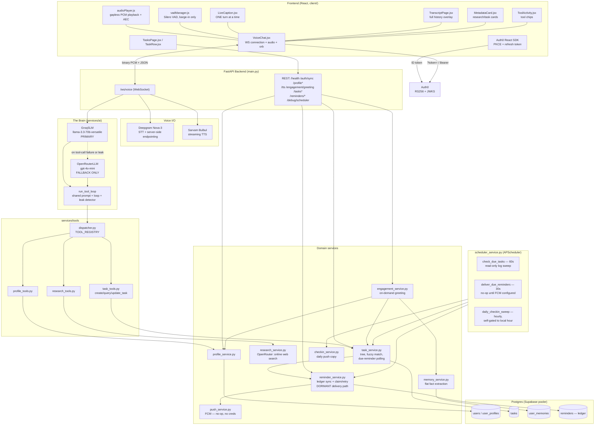

# Architecture Overview

A holistic, diagram-oriented map of the entire system — every service, how they're
interconnected, and how each individual process runs end to end. For narrative "why"
history see `recent_changes.md`; for a full code-level walkthrough with pipeline
examples see `system_explanation.md` (backend) / `frontend_explanation.md` (frontend).

This document reflects the codebase as of the July 2026 memory/task revamp
(`db_revamp.md`) plus everything since: reminder offsets hardcoded, the reminder/task
equivalence prompt fix, and the removal of `device_tokens` + push-notification
infrastructure. It supersedes any earlier version describing a knowledge graph,
`refresh_service.py`, or device-token push.

## Mental model, in one paragraph

A FastAPI backend exposes **one WebSocket** (the entire voice conversation) and **eleven
REST endpoints** (auth-gated CRUD/debug surfaces for the same data). One model — a
Groq-hosted Llama 3.3 70B — is the sole conversational brain: it reasons, decides, and
calls tools directly against Postgres. A second model (OpenRouter/gpt-4o-mini) exists
only as a structural twin, invoked solely when Groq's tool-calling glitches. A separate,
narrower model call handles web research (also OpenRouter/gpt-4o-mini, with the
`:online` search suffix), and a third separate call handles background memory
extraction. Everything else — auth, memory, the task tree, the scheduler, engagement
greetings — is plain deterministic Python/SQL feeding context into that one model's
prompt, not separate "agents."

Reminders have two independent mechanisms living side by side: a simple **polling**
path (`Task.last_reminded_at` + `GET /reminders/due`) that is what actually reaches the
user today, and a fuller **push-delivery ledger** (`Reminder` rows, claim/retry state
machine) that is fully built but currently dormant — there's no mobile app or FCM
credentials configured, so nothing consumes it yet.

---

## Architecture diagram (Mermaid)

---

## Backend, package by package

### `main.py` — the orchestrator
Owns the WebSocket lifecycle, all REST endpoints, the FastAPI `lifespan` (calls
`init_db()` then `start_scheduler()` on boot), and the per-turn pipeline
(`run_voice_pipeline`). This is the only file that wires every other package together
— nothing else imports from `main.py`.

### `core/config.py` — settings
One `Settings` class, env-driven, loaded once at import (`override=True` so the
project `.env` always wins over a stale machine-level var). Groups: Sarvam (legacy
STT, dead code today), Deepgram, Groq (the **active brain**), OpenRouter (fallback
LLM + research + memory extraction — all the same `OPENROUTER_LLM_MODEL` except
research, which has its own `OPENROUTER_RESEARCH_MODEL`), Auth0, `DATABASE_URL`,
reminder/scheduler tuning, FCM (unused today — no credentials configured), server
host/port/CORS. `GOOGLE_API_KEY`/`GEMINI_*`/`LLM_MODEL` are dead leftovers from a
pre-Groq design; the code never reads them. `REMINDER_DEFAULT_OFFSETS` used to live
here as an env var but was hardcoded into `reminder_service.py` (`_DEFAULT_OFFSETS =
[0, 10]`) since it was never actually customized per deployment.

### `db/session.py` — persistence plumbing
One async SQLAlchemy engine (`pool_size=10`, `max_overflow=10`, `pool_timeout=10`),
pointed at Supabase's **session pooler**, not the IPv6-only direct host. `init_db()`
runs `create_all` plus idempotent `ALTER TABLE ADD COLUMN IF NOT EXISTS` patches for
columns added after a table's first migration — there's no Alembic; every startup
statement is safe to re-run.

### `models/` — the schema (6 tables)
- `user.py` — `users`: `id` (the Auth0 `sub`), `display_name`, `email`. The identity
  anchor everything foreign-keys to.
- `user_profile.py` — `user_profiles`: 1:1 with `users`. Location, timezone, locale,
  daily check-in hour, onboarding flag, `preferences` JSON.
- `task.py` — `tasks`: a self-referential tree via `parent_id` only (grouping —
  a sub-step belongs to a milestone goal). No dependency/blocking chain, no
  `requires_research` flag — both were removed as rarely-exercised complexity (see
  `db_revamp.md`). `status` (pending/blocked/active/done/cancelled), `due_at` /
  `window_start` / `window_end`, `last_reminded_at` (the polling-path dedup flag),
  freeform `context` JSONB (research findings/links, notes).
- `user_memory.py` — `user_memories`: flat extracted facts — the single long-term
  memory store.
- `reminder.py` — `reminders`: the push-delivery ledger (see "Two reminder paths"
  below). One row per scheduled notification "fire," state machine `pending →
  claimed → sent`, with retry/failed terminal states. Built and synced on every task
  write, but not currently delivering anything (no FCM configured).

There is **no** `entities`/`entity_edges`/`reflections`/`mood_signals` (a knowledge
graph + reflection layer was built, then deliberately deleted — see `db_revamp.md`)
and **no** `device_tokens` (push-notification device registry, removed entirely since
the web client polls instead of receiving push).

### `services/auth/auth_service.py`
Verifies Auth0 ID tokens via RS256 + JWKS (no shared secret — PKCE needs none). Two
entry points: `get_current_user_id` (REST `Depends`, reads `Authorization: Bearer`)
and `authenticate_websocket` (reads `?token=`, closes the socket *before* `accept()`
on failure — browsers can't set WS headers, hence the query param instead of a
header).

### `services/voice/` — audio I/O
- `stt_deepgram.py` — **the live STT path**. Persistent WebSocket to Deepgram,
  auto-reconnect with backoff, real `KeepAlive` pings so the socket survives silent
  gaps during TTS playback, callbacks for interim/final/utterance-end.
- `tts.py` — **the live TTS path**. Persistent WebSocket to Sarvam Bulbul. Tracks
  `sentences_sent` vs `sentences_completed` so a per-sentence completion event doesn't
  end the whole multi-sentence stream early.
- `stt.py` — dead code (an SDK-based Sarvam STT class, superseded by Deepgram).

### `services/ai/` — the brain, one shared implementation
- `slm.py` — `_build_system_prompt()` (the single canonical prompt — see
  `system_explanation.md` §"The system prompt" for the full breakdown) and
  `run_tool_loop(client, model, messages, session_context)` (the multi-round
  tool-calling generator: two-layer leaked-tool-call detector, auto-attach of
  research findings into `create_task`/`update_task`, capped at 5 rounds). `GroqSLM`
  is a thin wrapper around both.
- `llm.py` — `OpenRouterLLM`, now **just a thin wrapper delegating to the exact same
  `run_tool_loop`/prompt**, pointed at OpenRouter instead of Groq. Exists solely as
  the fallback when Groq's tool-call formatting fails (a documented reliability gap
  for Llama 3.3 70B) or a leak is detected.

### `services/tools/` — what the brain can do (5 tools)
- `schemas.py` — OpenAI-format tool declarations: `create_task`, `query_tasks`,
  `update_task`, `research`, `update_profile`. `create_task`/`update_task` both
  explicitly state that "task" and "reminder" are the same request in their
  descriptions (a prompt-reliability fix — see `recent_changes.md`).
- `dispatcher.py` — `TOOL_REGISTRY` (name → function) + `execute_tool()`, with
  structured error handling so a failing tool yields a spoken-friendly error instead
  of crashing the turn.
- `task_tools.py` — thin adapters parsing model args → `task_service` calls.
  Contains the **structural consent gate**: `create_task` refuses to write unless
  `user_confirmed=true`.
- `research_tools.py` / `profile_tools.py` — same adapter pattern for
  `research_service` and `profile_service`.

### `services/tasks/task_service.py` — the task domain logic
CRUD, tree traversal (`parent_id` only), the deterministic fuzzy matcher (`find_task`
— exact id, then substring, then word-overlap, preferring open over closed tasks),
`find_relevant_tasks` (proactive per-turn context injection so a task's stored
research is in front of the model *before* it decides which tool to call — a fixed
DB lookup, not a model judgment), and the **polling reminder path**
(`get_due_reminders`/`consume_due_reminders`/`mark_reminded` — a simple flag on the
`Task` row itself, see below).

### `services/reminders/reminder_service.py` — the push-delivery ledger
`sync_for_task` reconciles a task's `Reminder` rows whenever it's created/updated
with a `due_at` — one row per offset, `fire_at = due_at - offset_minutes`, updated in
place (never duplicated) so a re-sync doesn't disturb an already-sent row. Also
provides `ramp_up_offsets` (the escalating "remind me until it starts" ladder) and
the claim/retry state machine (`claim_due`, `mark_sent`, `mark_retry`, `hold`) the
scheduler's `deliver_due_reminders` job would use — currently always a no-op since
`push_service.is_configured()` is False (no FCM credentials).

### `services/push/push_service.py`
Firebase Admin SDK wrapper for FCM. `is_configured()` gates every call site; when
False (the current state), nothing here ever executes and the rest of the app is
unaffected. Kept ready for whenever a mobile client + FCM credentials exist.

### `services/research/research_service.py`
One OpenRouter call (`openai/gpt-4o-mini:online` — the `:online` suffix gives it live
web search) with a prompt that forbids markdown in its output (findings are shown in
a UI card as plain prose, not spoken or rendered as markdown). Normalizes output to
`{summary, links, source_count}`.

### `services/memory/`
- `profile_service.py` — read/write `user_profiles`; `ensure_profile` creates the row
  on first contact; `complete_onboarding` is the one path that *overwrites*
  `display_name` (the user's own confirmed answer beats the OAuth-suggested name).
- `memory_service.py` — flat fact extraction (`remember`/`recall`) via one OpenRouter
  call per batch of turns, stored as rows in `user_memories`. This is the **only**
  memory store today — the knowledge-graph layer that used to sit alongside it was
  removed (`db_revamp.md`).

### `services/engagement/`
- `engagement_service.py` — the only consumer of profile + facts + active tasks at
  once, one LLM call (on Groq), **only on-demand** via `GET /engagement/greeting` —
  never on the conversation path.
- `checkin_service.py` — deterministic (no LLM) composer for the daily push-copy
  text, time-of-day aware (today vs tomorrow + overdue). Feeds the scheduler's daily
  check-in job, which is itself a no-op today (same FCM gate as reminder delivery).

### `services/scheduler/scheduler_service.py`
Three APScheduler jobs registered at boot, in-memory job store:
- `check_due_tasks` (60s) — read-only, just logs what's due via
  `task_service.get_due_reminders`. Never mutates.
- `deliver_due_reminders` (30s) — claims `Reminder` ledger rows and would push via
  FCM; currently always a no-op (`push_service.is_configured()` is False).
- `daily_checkin_sweep` (hourly) — self-gated to each user's local check-in hour;
  would push a daily summary via FCM; same no-op gate.

`get_job_status()` exposes `next_run_time` for the `/debug/scheduler` panel.

---

## Two reminder paths — why there are two, and which one is live

This is the single most confusing part of the system if you only skim the code, so
it's worth stating plainly:

**Path A — polling (LIVE, this is what users actually see today).**
`Task.last_reminded_at` is a single nullable timestamp on the task itself.
`task_service.get_due_reminders` finds open tasks whose `due_at` has passed and
`last_reminded_at` is still `None`; `consume_due_reminders` fetches AND stamps
`last_reminded_at` in one transaction — calling `GET /reminders/due` *is* the act of
delivery. The frontend polls this endpoint every 60 seconds (`VoiceChat.jsx`) and
shows a "Due now" card + fires a browser `Notification` for whatever comes back.
Simple, no ledger, no retry — a reminder either gets picked up on some future poll or
it doesn't, but it can never double-fire because consuming it is atomic.

**Path B — the `Reminder` ledger (BUILT, but dormant).**
Every task write calls `reminder_service.sync_for_task`, which creates/updates one
`Reminder` row per configured offset (default `[0, 10]` minutes before `due_at`).
The scheduler's `deliver_due_reminders` job claims due rows (`SELECT ... FOR UPDATE
SKIP LOCKED` — safe under concurrent workers) and would push them via FCM with full
retry/failed semantics. This is real, tested machinery — it's just never actually
sent anywhere, because `push_service.is_configured()` is False without FCM
credentials, so `deliver_due_reminders` returns immediately every time it runs.

**Why keep both?** Path B is what a real mobile app needs (push notifications that
work with the app closed); Path A is what the current web-only client needs (it can
only ever poll while the tab is open — there's no service worker). They're
independent, and Path B being unused right now costs nothing except one extra sync
call per task write.

---

## The three "processes" — step by step

### Process 1: a voice turn (the WS lifecycle)
1. Client connects `wss://.../ws/voice?token=<id_token>`. `authenticate_websocket`
   verifies it *before* `accept()`.
2. On accept: load/seed the user's profile, connect Deepgram + Sarvam eagerly.
3. Client streams raw PCM continuously. Deepgram emits interim transcripts
   (`stt.interim`) live; its own endpointing fires `on_utterance_end` with the final
   transcript.
4. `run_voice_pipeline` launches two concurrent tasks:
   - **Producer**: builds `[system_prompt, memory_context, ...history, user_turn]`,
     runs `GroqSLM.run_conversation` → `run_tool_loop`. Each round: stream tokens
     (buffered, not spoken yet); if tool calls appear, execute via `dispatcher`,
     auto-attach research findings, feed results back; only a tool-less final round
     gets spoken. On Groq tool-call failure or a detected leaked call, escalate once to
     `OpenRouterLLM` (same prompt/loop, different provider).
   - **Consumer**: drains completed sentences into `SarvamTTS.stream_tts()`, streams
     `tts.start` → binary PCM chunks → `tts.done` once every sentence (not just the
     first) has confirmed completion.
5. Barge-in (`interrupt` control message) cancels the pipeline task and resets both
   Deepgram and Sarvam sockets to drop stale audio.
6. End of turn: history appended (capped at 20 messages), and every 3rd turn a batched
   `memory_service.remember()` fires fire-and-forget.

### Process 2: a REST call
Each endpoint opens its own `async_session()`, does one focused thing, commits,
returns JSON — no shared state with the WS session beyond the same Postgres rows.
`/tts`, `/engagement/greeting`, and `/reminders/due` are the only ones that trigger
extra work beyond plain DB read/write (one-shot TTS synthesis, an LLM call, and an
atomic reminder-consume, respectively).

### Process 3: scheduler background jobs
Run inside the same process (`AsyncIOScheduler`, asyncio-native, no separate worker).
All three jobs fan out across every known user (`task_service.list_user_ids`). None of
them ever touch the live conversation — they're entirely decoupled, communicating only
through Postgres rows the next WS turn or REST call will read.

---

## Frontend (`client/src/`)
`main.jsx` wraps `App.jsx` in `Auth0Provider`. `App.jsx` gates a login screen behind
`isAuthenticated`, an onboarding screen behind `profile.onboarding_complete`, fetches
the ID token, and mounts a persistent shell: `VoiceChat.jsx` (the orb + WS + audio,
always mounted so the mic/socket survive view switches) with `TasksPage.jsx`
overlaying it translucently when the bottom nav switches views. `VoiceChat.jsx` owns
the WS connection, the VAD instance (`vadManager.js`, barge-in detection only —
Deepgram owns end-of-turn), the audio player (`audioPlayer.js`, pre-buffered +
look-ahead scheduled, routed through a hidden `<audio>` element for echo
cancellation), and renders `LiveCaption` (current turn only), `TranscriptPage` (full
history, opened on demand), `ToolActivity`, and `MetadataCard`.

See `frontend_explanation.md` for the full component-by-component walkthrough.

---

## REST + WebSocket surface (reference)

| Method | Path | Auth | Purpose |
|---|---|---|---|
| WS | `/ws/voice?token=<jwt>` | Auth0 ID token (query param) | The voice session |
| GET | `/health` | — | Liveness |
| POST | `/auth/sync` | Bearer | Provision/refresh identity + device timezone/locale at login |
| POST | `/profile/onboarding` | Bearer | Finalize first-run onboarding (name/location/check-in hour) |
| POST | `/tts` | Bearer | One-shot WAV synthesis for scripted prompts (onboarding voice) |
| GET | `/profile` | Bearer | Read profile (drives the onboarding gate) |
| POST | `/profile/location` | Bearer | Persist browser-resolved location |
| GET | `/engagement/greeting` | Bearer | On-demand personalized greeting |
| GET | `/tasks` | Bearer | List all (non-cancelled) tasks |
| DELETE | `/tasks/{id}` | Bearer | Soft-delete (sets status=cancelled) |
| PATCH | `/tasks/{id}` | Bearer | Set a task's status (done/active/pending/cancelled) |
| GET | `/reminders/due` | Bearer | **Consuming** — atomically fetch + mark due reminders (Path A) |
| POST | `/reminders/{id}/delivered` | Bearer | Mobile ack that a push notification surfaced (Path B, unused today) |
| GET | `/debug/scheduler` | Bearer | APScheduler job status |
