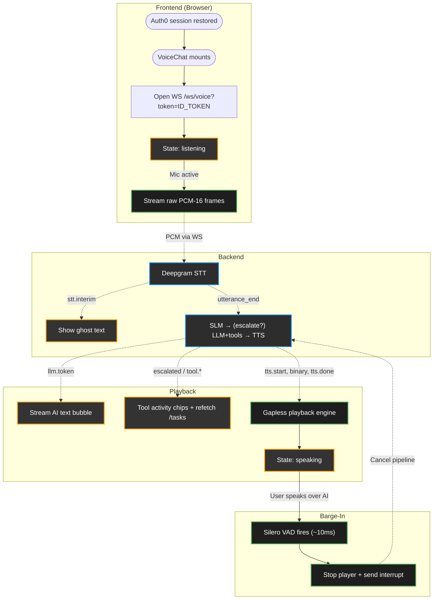

# Frontend — Code & Lifecycle Explanation

This document explains how the React client works: authentication and session
persistence, the always-on voice loop (client VAD for barge-in + server STT for
end-of-turn), the WebSocket protocol it speaks, the gapless audio playback
engine, and the task/tool test-harness UI.

The client is currently a **web test harness** for the backend (the production
app will be a separate React Native mobile client). It is fully functional: sign
in with Google, talk to the assistant, watch tool calls and persisted tasks
update live.

---

## 1. App Shell & Authentication

```
main.jsx → Auth0Provider → App.jsx → (Login | launch screen → VoiceChat)
```

### `main.jsx` — Auth0 provider
Wraps the app in `<Auth0Provider>` configured for **persistent sessions**:

```jsx
<Auth0Provider
  domain={VITE_AUTH0_DOMAIN}
  clientId={VITE_AUTH0_CLIENT_ID}
  authorizationParams={{
    redirect_uri: window.location.origin,
    scope: "openid profile email offline_access",
  }}
  cacheLocation="localstorage"
  useRefreshTokens
>
```

- **`offline_access` scope** → Auth0 issues a **refresh token**.
- **`cacheLocation="localstorage"`** → the session survives a full page reload
  (the default in-memory cache does not).
- **`useRefreshTokens`** → silent renewal uses the stored refresh token instead of
  a hidden-iframe check, which most browsers now block (that block was the cause
  of the "have to sign in again on every reload" bug).

> The actual session **duration** is set in the Auth0 dashboard (Application →
> Refresh Token Rotation → Absolute / Inactivity Expiration). The code above only
> makes the client correctly *use* a long-lived refresh token.

### `Login.jsx`
A single "Sign in with Google" button that calls
`loginWithRedirect({ authorizationParams: { connection: "google-oauth2" } })` —
skipping Auth0's hosted page and going straight to Google.

### `App.jsx`
- Uses `useAuth0()` for `isLoading`, `isAuthenticated`, `getAccessTokenSilently`,
  `getIdTokenClaims`, `logout`.
- While `isLoading`, renders a blank screen (avoids a login flash on reload while
  the session is being restored).
- When authenticated, it calls **`getAccessTokenSilently()`** first (this exercises
  the refresh-token renewal so the token is guaranteed fresh, not stale/expired),
  then reads the raw ID token from `getIdTokenClaims().__raw` and stores it in
  state.
- That raw **ID token** is passed to `<VoiceChat accessToken={idToken} />`. It is
  the credential the backend verifies — sent as `?token=` on the WS and as
  `Authorization: Bearer` on REST calls.

---

## 2. Frontend Lifecycle & Data Flow



---

## 3. Continuous Audio Streaming

Unlike push-to-talk, the client streams continuously:
1. **AudioWorklet / VAD** (`@ricky0123/vad-web`, Silero ONNX) processes the mic at
   16 kHz Float32 and fires `onFrameProcessed` per frame (~32 ms).
2. Each frame is converted to PCM-16 `Int16Array` and sent over the WebSocket
   **while the status is `listening` or `recording`** — the client never cuts you
   off; Deepgram decides end-of-turn server-side via semantic endpointing.
3. A **~500 ms ring buffer** (`RING_BUFFER_FRAMES = 15`) of recent frames is kept
   so that on a barge-in (when we weren't streaming during playback) the words
   that triggered it can be flushed to Deepgram and not lost.

---

## 4. The WebSocket Router (`VoiceChat.jsx`)

The connection auto-reconnects (2 s backoff) and carries the ID token as a query
param: `${WS_URL}?token=${encodeURIComponent(accessToken)}`.

### A. Binary frames (audio out)
An incoming `ArrayBuffer` is a chunk of TTS audio, forwarded straight to the
player: `playerRef.current.playChunk(event.data)`.

### B. JSON control messages
`handleMessage` switches on `data.type`:

| Type | UI effect |
|---|---|
| `processing` | status → `processing` ("thinking") |
| `stt.interim` | show live ghost text; status → `recording` |
| `stt.final` | update ghost text (segment finalized, turn may continue) |
| `stt.result` | commit the user's chat bubble; clear last turn's tool log |
| `stt.reconnecting` | the Deepgram STT socket dropped and is auto-reconnecting (currently ignored by the UI; safe to surface a "reconnecting" hint) |
| `escalated` | add an "escalated → intent" chip (turn needs a tool) |
| `tool.start` | add a "🔧 tool starting" chip |
| `tool.result` | add a result chip **and refetch `GET /tasks`** (tasks may have changed) |
| `llm.token` | append streaming token to the AI bubble |
| `llm.done` | stash the full response text (committed on `tts.done`) |
| `tts.start` | status → `speaking`; **reset the player** for a fresh turn |
| `tts.done` | flush remaining buffer; commit the AI bubble; when audio finishes, resume listening |
| `error` | log; commit partial response (flagged) ; resume listening |
| `interrupted` | stop the player and clear buffers (don't resume — user is talking) |
| `history_cleared` | clear messages + tool log |

### C. Client → server messages
Raw binary PCM frames, plus JSON `speech.start`, `interrupt`, `ping`, and
`clear_history`.

> **One `tts.start` … `tts.done` pair brackets the entire turn**, even when the
> answer is multiple sentences. The backend streams every sentence's audio inside
> that single bracket (the recent backend TTS fix ensures it no longer ends early
> after the first sentence), so the frontend needs no per-sentence logic — it just
> plays the continuous stream between start and done.

---

## 5. The Voice Activity Detection (VAD) Pipeline

Silero VAD runs locally in the browser. In this **hybrid architecture** it is used
strictly for **barge-in**, not for end-of-turn:
1. **AEC** — the player's output is bound to a hidden `<audio>` element
   (`getOutputStream()` → `srcObject`) so the assistant's voice doesn't feed back
   into the mic.
2. **Barge-in** — while the AI is `speaking`, if the user starts talking,
   `onSpeechStart` fires: stop the player, send `{type:"interrupt"}`, flush the
   ring buffer to Deepgram, and switch to `recording`.
3. **End-of-turn hint** — `onSpeechEnd` deliberately does **not** stop streaming;
   Deepgram must "hear" the trailing silence to fire `utterance_end`.

---

## 6. The Gapless Playback Engine (`utils/audioPlayer.js`)

`AudioPlayer` streams voice segments over the network without pops or gaps via
three mechanisms:

### A. Decode-free playback
Takes raw binary, casts to `Int16Array`, scales to Float32 — no MP3/Opus decode
overhead.

### B. Pre-buffering (jitter absorption)
Holds playback until at least `MIN_BUFFER_CHUNKS = 2` chunks are queued, absorbing
initial network jitter.

### C. Sample-accurate look-ahead scheduling
Each `AudioBufferSourceNode` is scheduled on the `AudioContext` timeline using a
floating `nextStartTime` marker synced to `audioContext.currentTime`, with a 50 ms
look-ahead so the audio clock never falls behind — guaranteeing seamless
concatenation.

**Turn boundaries:** `tts.start` calls `stop()` (clear queue, reset timeline) for a
clean turn; `tts.done` calls `flushAndPlay()` then polls `isActive()` every 200 ms
and only resumes listening once all scheduled audio has finished.

---

## 7. The Test-Harness UI

Beyond the chat transcript, two panels make the backend's behavior visible:
- **`ToolActivity.jsx`** — a live log of `escalated` / `tool.start` / `tool.result`
  chips for the current turn, so you can *see* the SLM → LLM escalation and each
  tool call.
- **`TasksPanel.jsx`** — renders persisted tasks from `GET /tasks` (with parent
  titles), refetched whenever a tool result arrives, so task creation/updates show
  up immediately.

---

## 8. Frontend Configuration (`client/.env`)

| Var | Purpose |
|---|---|
| `VITE_WS_URL` | Backend voice WebSocket (e.g. `ws://localhost:8000/ws/voice`) |
| `VITE_API_URL` | Backend REST base (e.g. `http://localhost:8000`) |
| `VITE_AUTH0_DOMAIN` | Auth0 tenant domain |
| `VITE_AUTH0_CLIENT_ID` | Auth0 application (SPA) client id |

> Auth0 dashboard must list the dev origin (e.g. `http://localhost:5173`) under
> **Allowed Callback URLs**, **Allowed Logout URLs**, and **Allowed Web Origins**,
> or the redirect login fails with "Callback URL mismatch."
