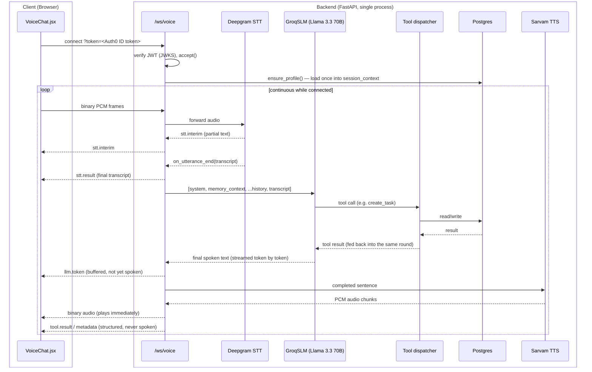

# Backend — System Architecture & Code Walkthrough

This document explains how the backend works at a code level: how the files fit
together, the lifecycle of a WebSocket connection, how each service functions, and —
new in this revision — full worked examples of the actual pipelines a request travels
through, with the real tool-call payloads and DB writes at each step.

The backend is a real-time, two-way conversational **voice-first personal
assistant**. It understands intent, calls tools, manages a durable task tree, runs
web research, delivers reminders, and remembers the user across sessions. Everything
is governed by one voice loop over a single authenticated WebSocket.

This revision supersedes earlier descriptions of a three-layer SLM→escalate→LLM
router, a task dependency/blocking chain, a `mood_log`/sentiment system, and a daily
research-refresh scheduler — all removed in the memory/task simplification
(`docs/db_revamp.md`). See `docs/recent_changes.md` for the running narrative log of
what changed and why.

---

## 1. The big picture



Two things to notice immediately, because they explain most of the design decisions
below:

1. **Text and audio are two separate streams racing each other.** The moment a full
   sentence is ready, it goes to TTS while the model is still generating the rest of
   the answer — that's what makes the conversation feel continuous instead of "type,
   wait, get a wall of text read aloud."
2. **Tool results never get spoken verbatim.** A round of the model's output that
   *also* contains a tool call is discarded from speech entirely — only a tool-less
   final round is voiced. This structurally prevents a stale "let me check that"
   pre-research answer from playing over the real, researched one.

---

## 2. Directory structure

Packages live **flat at the project root** (no `app/` wrapper). Each top-level
package owns one concern:

```
main.py                     FastAPI app: WebSocket pipeline + all REST endpoints
core/config.py              All settings, loaded from .env (flat settings class)
db/session.py               Async SQLAlchemy engine, session factory, init_db()
utils/timez.py              Timezone-aware datetime helpers (ensure_aware, now_local)
utils/audio.py              WAV-header helper (not wired into the live path)

models/                     SQLAlchemy 2.0 ORM models — 6 tables total
  base.py                     Declarative Base
  user.py                     users          (id = Auth0 `sub`)
  user_profile.py              user_profiles  (name, location, tz, check-in hour)
  task.py                      tasks          (self-referential tree via parent_id)
  reminder.py                  reminders      (push-delivery ledger — see §8)
  user_memory.py               user_memories  (flat extracted facts — the one long-term store)

services/
  auth/auth_service.py        Verify Auth0 ID tokens (REST dep + WS guard)
  voice/
    stt_deepgram.py             Deepgram Nova-3 streaming STT (the live path)
    tts.py                       Sarvam Bulbul streaming TTS (the live path)
    stt.py                       dead code — superseded by Deepgram
  ai/
    slm.py                       GroqSLM — the one brain, prompt + tool loop
    llm.py                       OpenRouterLLM — fallback, delegates to slm.py's loop
  tools/
    schemas.py                   OpenAI-format tool declarations (5 tools)
    dispatcher.py                execute_tool(name, args, ctx) with safe errors
    task_tools.py                create/query/update_task adapters + consent gate
    research_tools.py            research tool adapter
    profile_tools.py             update_profile adapter
  tasks/task_service.py        Task CRUD, tree, fuzzy match, due-reminder polling
  research/research_service.py  One web-search-capable LLM call (OpenRouter :online)
  reminders/reminder_service.py Push-delivery ledger: sync + claim/retry state machine
  push/push_service.py          FCM sender — no-op until credentials exist
  memory/
    profile_service.py           Read/seed the structured user profile
    memory_service.py            remember() / recall() flat facts
  engagement/
    engagement_service.py        On-demand personalized greeting (one LLM call)
    checkin_service.py           Deterministic daily push-copy composer (no LLM)
  scheduler/scheduler_service.py APScheduler jobs (detect / deliver / check-in)
```

---

## 3. The model stack — who does what

| Role | Provider / model | When it runs | Why this one |
|---|---|---|---|
| **Conversational brain** | Groq, `llama-3.3-70b-versatile` | Every voice turn | Lowest time-to-first-token of the options tried; the 8B default (`SLM_MODEL`'s code default) was too unreliable at tool-calling and at following the "don't recite lists" style rule, so `.env` bumps it to 70B |
| **Fallback brain** | OpenRouter, `openai/gpt-4o-mini` | Only when Groq's tool-call formatting fails, or a leaked tool call is detected in the spoken text | Delegates to the **exact same** prompt and tool loop (`run_tool_loop`) as Groq — a Groq hiccup degrades reliability, never behavior |
| **Web research** | OpenRouter, `openai/gpt-4o-mini:online` | Only when the `research` tool is called | The `:online` suffix gives it live web search without a separate search vendor |
| **Background memory extraction** | OpenRouter, `openai/gpt-4o-mini` | Every 3rd conversation turn, fire-and-forget | Cheap, off the hot path, batched so it isn't one extra LLM call per turn |
| **Engagement greeting** | Groq, `llama-3.3-70b-versatile` | Only on `GET /engagement/greeting` | Same brain, but never on the conversation path — latency doesn't matter here |

All five are reached through the same `openai` SDK pointed at different `base_url`s,
since Groq and OpenRouter are both OpenAI-compatible endpoints — this is why swapping
the fallback provider or the research model is a one-line `.env` change, not a code
change. `GOOGLE_API_KEY`/`GEMINI_*`/`LLM_MODEL` still exist in `config.py` but nothing
reads them — leftovers from a pre-Groq design.

---

## 4. Authentication (`services/auth/auth_service.py`)

Login happens **entirely on the frontend** via the Auth0 React SDK (Authorization
Code + PKCE), including the Google social connection. The backend never talks to
Auth0's token endpoint or to Google — its only job is to verify the **ID token** the
frontend already obtained.

- **`decode_token(token)`** — verifies the JWT signature against Auth0's public
  **JWKS** (`https://{AUTH0_DOMAIN}/.well-known/jwks.json`, cached in-process),
  algorithm **RS256**, `audience = AUTH0_CLIENT_ID`, `issuer = https://{AUTH0_DOMAIN}/`.
  Returns the claims. There is no shared secret (asymmetric — nothing to leak).
- **`get_current_user_id(creds)`** — FastAPI dependency for REST endpoints; reads
  `Authorization: Bearer <jwt>` and returns the verified `sub`.
- **`get_current_claims(creds)`** — same, but returns the full claims dict, for the
  one endpoint (`/auth/sync`) that needs name/email, not just the id.
- **`authenticate_websocket(ws)`** — browsers can't set custom headers on a WS
  upgrade, so `/ws/voice` carries the token as `?token=`. This verifies it
  **before** `ws.accept()`, closing with code `1008` on failure.

The verified **`sub`** claim (e.g. `google-oauth2|1234…`) **is** the user id used
everywhere: it's the primary key of the `users` row and the foreign key on every
task, profile, memory, and reminder row. Sign in as the same Google account → same
`sub` → same data.

---

## 5. The WebSocket lifecycle (`main.py`)

`voice_websocket()` handles one full-duplex session.

### A. Connect
1. `authenticate_websocket()` verifies `?token=` → claims (or close + return).
2. `ws.accept()`, `user_id = claims["sub"]`.
3. Per-session state: `conversation_history` (in-memory chat context),
   `pipeline_task` (the running turn), `session_context` (`{user_id, profile, ...}`).
4. Per-session services: a dedicated `SarvamTTS` and `DeepgramStreamingSTT`.
5. **`profile_service.ensure_profile(user_id, …)`** — the only memory read on the
   connect path. On first contact it seeds `display_name`/`email` from the Google
   claims; the profile is cached into `session_context`.
6. TTS and STT WebSockets are connected eagerly (both are used on every response, so
   there's no reason to wait).

### B. Main loop (`await ws.receive()`)
- **Binary frames** → raw PCM forwarded straight to Deepgram (`send_audio`).
- **JSON control messages**:
  - `speech.start` — client VAD heard speech; reset the Deepgram transcript.
  - `interrupt` — barge-in: cancel `pipeline_task`, then `close()`+`connect()` both
    the TTS and STT sockets to drop any pending/stale audio.
  - `clear_history` — wipes `conversation_history` server-side (paired with the
    frontend's "clear" button).
  - `location` — a browser-resolved location, applied live to `session_context` so
    the *very next* turn is already location-aware (the durable save happens
    separately via `POST /profile/location`).
  - `ping` → `pong`.
- **Disconnect** → break, cancel the pipeline, close STT/TTS.

### C. End-of-turn trigger
Deepgram's callbacks drive everything:
- `on_interim_transcript` → `stt.interim` (live ghost text).
- `on_final_transcript` → `stt.final` (finalized segment).
- `on_utterance_end` → sends `stt.result`, cancels any still-running previous
  pipeline (and resets TTS), then launches `run_voice_pipeline()` as a background
  task. Running in a background task is what keeps the receive loop free to catch
  a barge-in mid-response.

---

## 6. The voice pipeline (`run_voice_pipeline`)

One user turn. Two coroutines run concurrently via `asyncio.gather` and hand off
through an `asyncio.Queue[str | None]` of finished sentences — so the user hears
sentence 1 while the model is still generating sentence 2.

### Task A — `_produce_text()` (text producer)
1. Build `messages = [system_prompt, memory_context, ...history, user turn]` (see
   §7 for what `memory_context` contains) and run
   `slm_service.run_conversation(messages, session_context)`.
2. Each streamed event:
   - `text` → sent to the client as `llm.token` **and** buffered into the sentence
     accumulator.
   - `tool.start` → forwarded to the client (renders a tool chip); the **first**
     tool call of the turn also triggers a short spoken filler ("One moment." /
     "Let me look that up for you.") so the user isn't sitting in silence during a
     slow round-trip — pushed straight to TTS, but never recorded as part of the
     answer text or conversation history.
   - `tool.result` → forwarded to the client, plus a deterministic pass
     (`_extract_presentable_metadata`) that pulls structured data (research
     findings/links, a queried task's stored context) into a separate `metadata`
     WS message for the UI to render as a card — independent of whether the model
     chose to mention any of it out loud.
   - `fallback` → escalate to `OpenRouterLLM` (§10) with the exact same message list.
3. **Sentence buffering** — tokens accumulate in `sentence_buf`; when the buffer is
   >5 chars and ends in a sentence-ender (`.!?।;:`), the whole sentence is pushed to
   the queue. Leftover text is flushed at the end, then a `None` sentinel signals
   "no more sentences."
4. **After the turn** — send `llm.done` with the full text, append the user+assistant
   messages to `conversation_history` (capped at 20 messages), and — every 3rd turn
   — fire a **background, non-blocking** batched call to `memory_service.remember()`
   over the buffered exchanges. Never awaited inline; a slow extraction call must
   never delay the next turn.

### Task B — `_tts_to_client()` (audio consumer)
Drains the sentence queue into `tts_service.stream_tts()` and forwards every PCM
chunk to the client: one `tts.start` before the first chunk, raw binary chunks via
`ws.send_bytes()`, and one `tts.done` at the very end.

---

## 7. The system prompt, section by section

`services/ai/slm.py::_build_system_prompt()` is rebuilt on every call (not cached at
import time) so "today's date" never goes stale on a long-running process, and it's
the single canonical prompt shared by both Groq and the OpenRouter fallback. It reads,
in order:

1. **Identity + date/time anchor.** States today's date and current local time
   explicitly, and instructs the model to resolve every relative date ("next month",
   "this December") against *that*, never its training data — a model's confidence
   about "what year it is" is exactly the failure mode this guards against.
2. **"Reminder" and "task" are the same thing — always.** A dedicated paragraph
   stating this before any other rule, because the two words were previously treated
   as different intents in practice (a user asking to "set a reminder" wasn't
   reliably recognized as a `create_task` request the way "create a task" was).
   Reinforced again in the `create_task`/`update_task` tool descriptions themselves
   and in the dedicated REMINDERS section further down — four separate places,
   deliberately redundant.
3. **SCOPE.** Stay on tasks/reminders/planning/research; brief answers for
   off-topic chit-chat.
4. **PERSONALIZATION.** Use the profile block (location/timezone) without making the
   user repeat it; save a newly-mentioned stable detail via `update_profile`
   immediately.
5. **RESEARCH.** Any specific, time-varying fact (a date, price, deadline) must be
   verified via the `research` tool before answering or creating a task — "your
   confidence about a specific current date is exactly the trap."
6. **SPEAKING RESEARCH RESULTS.** After `research` returns, speak ONE short summary
   sentence, never a recited list of every venue/link — the full findings are shown
   automatically as a UI card.
7. **CREATING TASKS — ASK FIRST UNLESS TOLD.** The structural consent gate: did the
   user explicitly ask for something, or is the model only inferring it'd help? Only
   the former calls `create_task` with `user_confirmed=true`.
8. **Building multi-step goals as a tree** via `parent_task`, checking the "existing
   tasks that may relate" context block first so a new step nests under the right
   goal instead of floating unlinked.
9. **REMINDERS.** Default offsets are `[0, 10]` minutes before due;
   `remind_until_start` for an escalating "remind me until it starts" cadence — one
   task, never dozens of `create_task` calls to fake repetition.
10. **COMPLETING TASKS.** "I did it" / "mark that done" is a status change
    (`update_task` with `new_status="done"`), never just an acknowledgement.
11. **ANSWERING QUESTIONS ABOUT TASKS.** Always call `query_tasks` first; never
    answer from memory.

---

## 8. Worked pipeline #1 — "Remind me to call mom tomorrow at 6pm"

This is the simplest end-to-end case: a single-step reminder with a clock time, no
research needed.

**Step 1 — STT.** Deepgram finalizes the utterance; `on_utterance_end` fires with
`transcript = "Remind me to call mom tomorrow at 6pm"`. `main.py` sends
`{"type": "stt.result", "text": "..."}` to the client and launches
`run_voice_pipeline`.

**Step 2 — memory context assembly.** `_memory_context()` builds a system message
from three sources: profile fields already in `session_context` (name/location/
timezone), `memory_service.recall()` (recent durable facts), and
`task_service.find_relevant_tasks()` (active tasks whose title word-overlaps this
utterance — here, probably none, since "call mom" is new). The assembled block looks
like:

```
What you know about the user (use it to personalize, don't recite it):
User's name: Asha.
Location: Pune, India.
Timezone: Asia/Kolkata.
Remembered facts about the user:
- prefers concise answers
```

**Step 3 — the model call.** `messages = [system, memory_context, ...history, user
turn]` goes to `GroqSLM.run_conversation`. The model resolves "tomorrow at 6pm"
against the current-time anchor in the system prompt (in IST, since that's the
profile timezone) and recognizes this as an explicit request — so it calls:

```json
{
  "name": "create_task",
  "arguments": {
    "title": "Call mom",
    "due_at": "2026-07-20T18:00:00+05:30",
    "user_confirmed": true
  }
}
```

Note `reminder_offsets_minutes` is omitted — the model doesn't need to set it unless
the user asked for a specific lead time, so the default `[0, 10]` applies downstream.

**Step 4 — dispatch → task_tools.create_task → task_service.create_task.**
`user_confirmed=true` passes the consent gate. A `Task` row is inserted
(`status="pending"`, the parsed `due_at`). Since no `parent_task` was given, it's a
standalone task, not a milestone. Then:

```python
offsets = reminder_offsets  # None here → sync_for_task falls back to _DEFAULT_OFFSETS
await reminder_service.sync_for_task(session, task, offsets)
```

`sync_for_task` computes `fire_at = due_at - offset` for `[0, 10]` → two `Reminder`
ledger rows: one at `2026-07-20T18:00:00+05:30` (offset 0) and one at
`2026-07-20T17:50:00+05:30` (offset 10), both `status="pending"`. These feed the
dormant push-delivery path (see §9) — they don't do anything visible yet, but
they're correctly queued in case a mobile client shows up later.

**Step 5 — response back to the model, then to speech.** The tool result
`{"ok": true, "task": {...}, "summary": "Created task 'Call mom'."}` is fed back into
the same round. The model's next (tool-less) round produces the actual spoken
answer, e.g. *"Done — I'll remind you to call mom tomorrow at 6."* That text streams
sentence-by-sentence into `SarvamTTS.stream_tts()` while still being generated.

**Step 6 — what the frontend sees.** `tool.start` → `tool.result` (renders a "✓ task"
chip in `ToolActivity`) → `llm.token`s (live-captioned by `LiveCaption`) → `tts.start`
→ binary audio → `tts.done` (commits the full turn into `messages`, clearing the live
caption).

**Step 7 — later, delivery (Path A, the live one).** Every 60 seconds the frontend
calls `GET /reminders/due`. At 18:00 IST the next day, `consume_due_reminders` finds
this task (`due_at <= now`, `last_reminded_at IS NULL`), stamps `last_reminded_at`,
and returns it — the frontend shows a "Due now" card and fires a browser
`Notification`. The two `Reminder` ledger rows created in Step 4 are *not* what
caused this — they'd only matter if the (currently unconfigured) FCM push path were
active.

---

## 9. Worked pipeline #2 — research chained into task creation

User: *"When does JLPT registration open in December? Remind me."*

**Step 1 — the RESEARCH rule fires.** "When does registration open" is a specific,
time-varying fact — the model's training data is stale for it by definition, so the
system prompt forces a `research` call before answering:

```json
{"name": "research", "arguments": {"query": "JLPT December 2026 registration open date"}}
```

**Step 2 — `research_tools.research` → `research_service`.** One OpenRouter call to
`openai/gpt-4o-mini:online`, with a system prompt anchored to today's real date (same
staleness guard as the main brain) and forbidding markdown in the output (the
findings render in a UI card as plain prose, not spoken text with literal `**bold**`
in it). Returns:

```json
{
  "summary": "JLPT registration for the December 2026 sitting typically opens in early September and closes in early October, via the official JLPT portal.",
  "links": [{"label": "JLPT Official Site", "url": "https://www.jlpt.jp/e/"}],
  "source_count": 1
}
```

**Step 3 — spoken summary, not recitation.** The SPEAKING RESEARCH RESULTS prompt
rule means the model says something like *"Registration usually opens in early
September — want me to set a reminder for then?"* — one sentence, not a read-out of
the link or every detail. Meanwhile `main.py::_extract_presentable_metadata()`
deterministically pulls the full `links`/`findings` out of the tool result
(regardless of what the model chose to say) and sends a separate
`{"type": "metadata", "tool": "research", "data": {...}}` WS message — this is what
`MetadataCard.jsx` renders as a clickable card. The model cannot forget to surface
this; it's a code-level extraction, not something the model has to remember to do.

**Step 4 — the user confirms, task creation reuses the research.** If the user says
"yes", the next round calls `create_task`. Because a `research` call already
succeeded this turn, `run_tool_loop`'s **deterministic auto-attach** threads the same
findings into the call automatically even if the model's own arguments omit
`research_summary`/`source_links` — a data-plumbing fix for the observed failure
mode where the model spoke the findings but never copied them into the task write.
The resulting `Task.context` ends up as:

```json
{"research": {"summary": "JLPT registration for the December 2026 sitting...", "links": [{"label": "JLPT Official Site", "url": "https://www.jlpt.jp/e/"}]}}
```

**Step 5 — later recall.** If the user later asks "what was that JLPT link again?",
`ANSWERING QUESTIONS ABOUT TASKS` forces a `query_tasks(scope="specific_task",
search_text="JLPT")` call rather than answering from memory; the stored
`context.research` comes back intact and `_extract_presentable_metadata` surfaces it
as a card again — the link was never lost, even though it was only *spoken* once, on
a completely different turn.

---

## 10. Worked pipeline #3 — completing a task

User: *"I finished registering for the marathon."*

The COMPLETING TASKS prompt rule treats this as a status report, not a question —
the model calls:

```json
{"name": "update_task", "arguments": {"task": "marathon", "new_status": "done"}}
```

`task_tools.update_task` → `task_service.update_task`: `find_task` resolves
"marathon" via substring/word-overlap fuzzy match against the user's task titles
(preferring open tasks over closed ones), sets `status="done"`, and — because
`new_status` is a closing status — calls `reminder_service.cancel_for_task`, which
flips any still-`pending`/`claimed` ledger rows for that task to `cancelled` (rows
that already fired stay `sent`, as a delivery record). This is why a finished task
never pings again even though its `Reminder` rows technically still exist in the
table.

---

## 11. Memory — what gets remembered and how

Two separate mechanisms, deliberately kept apart:

- **Conversation history** — the literal `[{"role": ..., "content": ...}]` list held
  in `session_context` for the life of one WS connection, capped at 20 messages.
  This is what makes a single conversation feel coherent; it's never written to the
  database and disappears when the socket closes.
- **Long-term memory (`user_memories`)** — every 3rd turn, `_learn_from_turns` fires
  a single batched OpenRouter call (`memory_service.remember`) over the last 3
  exchanges, extracting durable preferences/facts/goals (never one-off task details
  — those already live on the `Task` row) as short third-person strings,
  de-duplicated against what's already stored. `memory_service.recall()` reads the
  most recent `MEMORY_RECALL_LIMIT` (default 10) rows back into the next turn's
  prompt.

There is deliberately no vector database or knowledge graph here today — an earlier
version of this system extracted entities and timestamped relationship edges into a
temporal graph, with a separate "reflection" sweep diffing it over time. It was
removed (`db_revamp.md`) because it was queried on the hot path every turn for low
incremental value over the flat store, at a real latency/complexity cost. The
`memory_service` interface (`recall`/`remember`) is kept backend-agnostic
specifically so a future swap to vector search only touches that one file.

---

## 12. Reminders — the two independent paths, in detail

**Path A (live) — `Task.last_reminded_at`.**
```
get_due_reminders(user_id):
    SELECT * FROM tasks
    WHERE user_id = :uid
      AND status IN ('pending', 'active')
      AND due_at IS NOT NULL AND due_at <= now()
      AND last_reminded_at IS NULL
```
`consume_due_reminders` runs this query AND stamps `last_reminded_at = now()` for
every row returned, in the same transaction, inside `GET /reminders/due`. Because
fetch-and-mark are atomic, a second concurrent call (or a second browser tab) gets
an empty result — there's no window where a reminder could be delivered twice or
silently dropped between "detect" and "mark delivered." The scheduler's
`check_due_tasks` job runs the read side every 60s purely for logging visibility; it
never marks anything, so it can't race with the REST endpoint.

**Path B (dormant) — the `Reminder` ledger.** A full work-queue: `pending → claimed
→ sent`, with `failed` after `REMINDER_MAX_ATTEMPTS` (default 5) and automatic
reclaim of a `claimed` row that's been stuck longer than
`REMINDER_CLAIM_TIMEOUT_SECONDS` (default 120s — covers a crashed send). `claim_due`
uses `SELECT ... FOR UPDATE SKIP LOCKED` so concurrent scheduler ticks (or a future
multi-worker deploy) never claim the same row twice. Every task write calls
`sync_for_task` to keep these rows current regardless of whether anything ever
consumes them — so turning on Path B later (adding a mobile client + FCM
credentials) requires zero backfill; the ledger's already correct for every
existing task.

**Why the offsets are a hardcoded constant, not an env var.**
`_DEFAULT_OFFSETS = [0, 10]` lives directly in `reminder_service.py`. It used to be
`REMINDER_DEFAULT_OFFSETS` in `.env`, but it was never actually customized across any
deployment — an env var that's never touched is just noise in the config surface, so
it became a plain module constant.

---

## 13. Engagement & the scheduler

`services/engagement/engagement_service.py::generate_greeting` is the only consumer
of profile + facts + active tasks all at once, in a single Groq call, purely
on-demand via `GET /engagement/greeting` — never on the conversation path, so its
latency doesn't matter.

`services/scheduler/scheduler_service.py` starts three APScheduler jobs in the
FastAPI `lifespan` (in-memory job store — nothing to persist beyond what's already
durable in Postgres):

- **`check_due_tasks`** (every `REMINDER_SWEEP_SECONDS`, default 60s) — read-only,
  just logs what's currently due via `task_service.get_due_reminders`.
- **`deliver_due_reminders`** (every `REMINDER_DELIVERY_SECONDS`, default 30s) —
  claims `Reminder` ledger rows and would push via FCM; currently always a no-op
  since `push_service.is_configured()` is False.
- **`daily_checkin_sweep`** (hourly) — self-gated to each user's local check-in
  hour, composes a deterministic (no-LLM) daily summary via `checkin_service` and
  would push it; same no-op gate as above.

All three fan out across every known user via `task_service.list_user_ids()`. None of
them ever touch the live conversation — they're entirely decoupled, communicating
only through Postgres rows the next WS turn or REST call will read.
`get_job_status()` exposes `next_run_time` for the `/debug/scheduler` endpoint.

---

## 14. Fallback — what happens when Groq misbehaves

`llama-3.3-70b-versatile` has a documented tool-calling reliability gap: sometimes it
raises `openai.APIError` outright, and sometimes — worse — it streams a malformed
tool call as ordinary text instead of a real `tool_calls` entry, which would
otherwise get spoken verbatim as something like
`<function(update_task){"task": "...", ...}`.

`run_tool_loop` catches both:
1. A raised `APIError` → yields `{"type": "fallback"}` immediately.
2. A two-layer leak detector runs on every round of spoken text: a **primary** check
   for any of the app's own tool names (`create_task`, `query_tasks`, etc. — built
   directly from `TOOL_REGISTRY` so it can't drift out of sync) appearing verbatim
   in text that's supposed to be natural speech, and a **secondary** structural
   check for an opening brace/angle-bracket immediately followed by something
   key-shaped. Either match also yields `{"type": "fallback"}` instead of speaking
   the leaked text.

`main.py` catches the `fallback` event and escalates the **entire conversation so
far** to `OpenRouterLLM`, which runs the identical `run_tool_loop`/prompt against
`gpt-4o-mini` instead — so a Groq hiccup produces a slower turn, never a differently
(worse) behaved one. If both providers fail in the same turn (e.g. both
rate-limited), the pipeline speaks a graceful apology rather than dead-ending in
silence.

---

## 15. Text-to-Speech (`services/voice/tts.py`)

`SarvamTTS` holds **one persistent** WebSocket to Sarvam
(`wss://api.sarvam.ai/text-to-speech/ws`, `send_completion_event=true`), reused
across turns. `stream_tts(text_chunks)` runs a background `_send_text()` task that
sends each sentence followed by a `flush`, and a receive loop that decodes base64
WAV, strips the header, and yields raw PCM-16.

Sarvam emits a `final`/`completion` event **per flushed sentence**, not once per
whole turn — so the loop tracks `sentences_sent` vs `sentences_completed` and only
ends the generator once both "no more sentences will be sent" and "every sentence
sent has completed" are true. Ending on the *first* sentence's completion (an
earlier bug) left later sentences' audio sitting unread on the persistent socket,
leaking into the start of the next turn.

---

## 16. REST endpoints — quick reference

See `architecture_overview.md`'s REST + WebSocket surface table for the full list
with auth/purpose. Two endpoints are worth calling out specifically because their
names undersell what they do:

- **`GET /reminders/due` is not read-only** — calling it marks whatever it returns
  as delivered. It's designed to be called "whenever it's a good time to check" (app
  open, a poll interval), not idempotently.
- **`DELETE /tasks/{id}` and `PATCH /tasks/{id} {status: "cancelled"}` do the same
  thing** — both are a soft-delete (`status="cancelled"`), never a real row delete.
  The frontend's Tasks page uses PATCH exclusively (for done/cancelled/reopen);
  DELETE is kept as an equivalent REST-conventional alias, currently unused by the
  client.

**Server → client WS messages:** `processing`, `stt.interim`, `stt.final`,
`stt.result`, `stt.reconnecting`, `llm.token`, `tool.start`, `tool.result`,
`metadata`, `llm.done`, `tts.start`, binary audio frames, `tts.done`, `notice`,
`error`, `interrupted`, `history_cleared`.
**Client → server WS messages:** raw binary PCM, `speech.start`, `interrupt`,
`clear_history`, `location`, `ping`.

---

## 17. Configuration (`core/config.py` / `.env`)

All settings load from `.env` into a flat settings class (`override=True`, so the
project `.env` always wins over a stale machine-level var). Key groups:
- **Voice** — `DEEPGRAM_*` (STT), `SARVAM_*` (TTS voice/language/model/sample rate).
- **Brain** — `GROQ_API_KEY`, `GROQ_BASE_URL`, `SLM_MODEL`.
- **Fallback/research/memory** — `OPENROUTER_API_KEY`, `OPENROUTER_BASE_URL`,
  `OPENROUTER_LLM_MODEL` (fallback brain + memory extraction), `OPENROUTER_RESEARCH_MODEL`.
- **Auth** — `AUTH0_DOMAIN`, `AUTH0_CLIENT_ID`, `AUTH0_CLIENT_SECRET`.
- **Database** — `DATABASE_URL` (must be `postgresql+asyncpg://…`; use Supabase's
  **session pooler** host, not the direct `db.<ref>.supabase.co` host, which is
  IPv6-only and times out on most networks).
- **Reminders** — `REMINDER_SWEEP_SECONDS`, `REMINDER_DELIVERY_SECONDS`,
  `REMINDER_MAX_ATTEMPTS`, `REMINDER_CLAIM_TIMEOUT_SECONDS`, `REMINDER_BATCH_LIMIT`,
  `REMINDER_MAX_RAMP` (default reminder offsets are a hardcoded constant, not an env
  var — see §12).
- **Memory/check-in** — `MEMORY_RECALL_LIMIT`, `DAILY_CHECKIN_HOUR`.
- **Push (FCM)** — `FCM_CREDENTIALS_JSON` / `FCM_CREDENTIALS_FILE` /
  `FCM_PROJECT_ID` — all unset today, so the push-delivery path is a safe no-op.
- **Server** — `HOST`, `PORT`, `CORS_ORIGINS`.

> `GOOGLE_API_KEY` / `GEMINI_*` / `LLM_MODEL` remain in `config.py` but are dead —
> nothing reads them. Leftovers from a pre-Groq design.
