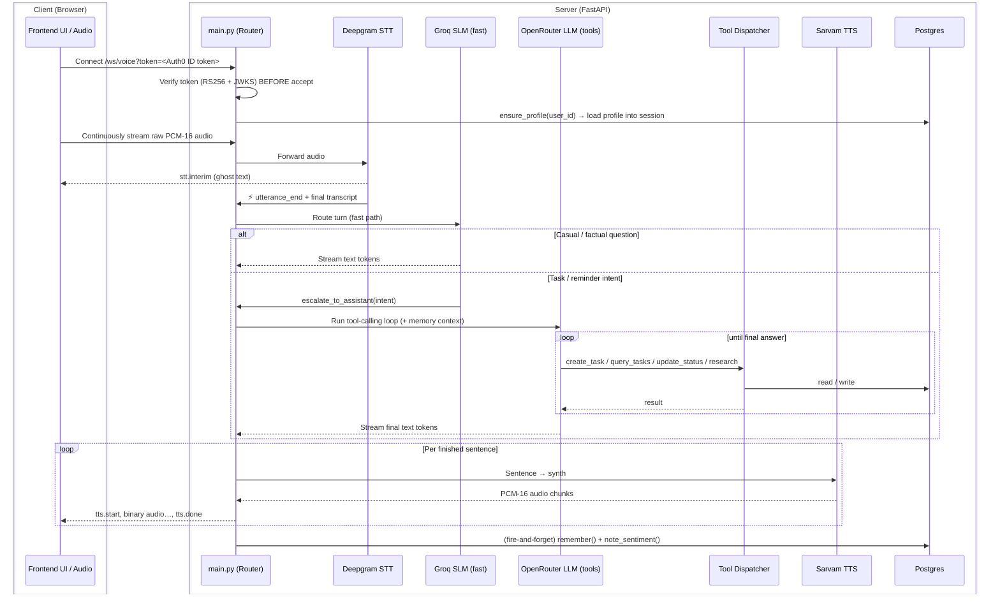

# Backend — System Architecture & Code Walkthrough

This document explains how the backend works at a code level: how the files fit
together, the lifecycle of a WebSocket connection, how each service functions, and
how the asynchronous voice pipeline operates in real time.

The backend is a real-time, two-way conversational **voice-first personal
assistant**. It is no longer a plain "speak text → hear text" engine — it
understands intent, calls tools, manages a durable task tree, runs web research,
delivers reminders, and remembers the user across sessions. Everything is
governed by one voice loop over a single authenticated WebSocket.

---

## 1. The Big Picture



---

## 2. Directory Structure

Packages live **flat at the project root** (no `app/` wrapper). Each top-level
package owns one concern:

```
main.py                     FastAPI app: WebSocket pipeline + REST endpoints
core/config.py              All settings, loaded from .env (flat settings class)
db/session.py               Async SQLAlchemy engine, session factory, init_db()
utils/audio.py              Audio helpers (WAV header handling, etc.)

models/                     SQLAlchemy 2.0 ORM models
  base.py                     Declarative Base
  user.py                     users         (id = Auth0 `sub`)
  task.py                     tasks         (self-referential task tree)
  user_profile.py             user_profiles (name, tz, sentiment, prefs)
  user_memory.py              user_memories (free-form recalled facts)
  mood_log.py                 mood_log      (per-turn sentiment signals)

services/
  auth/auth_service.py        Verify Auth0 ID tokens (REST dep + WS guard)
  voice/
    stt_deepgram.py           Deepgram Nova-3 streaming STT
    tts.py                    Sarvam Bulbul streaming TTS
  ai/
    slm.py                    Groq fast SLM (answers or escalates)
    llm.py                    OpenRouter tool-calling LLM
  tools/
    schemas.py                OpenAI-format tool declarations
    dispatcher.py             execute_tool(name, args, ctx) with safe errors
    task_tools.py             create/query/update task implementations
    research_tools.py         research tool implementation
  tasks/task_service.py       Task CRUD, tree traversal, dependency unblocking
  research/
    research_service.py       Live web-search call (OpenRouter)
    refresh_service.py        Daily re-check of "watched" research tasks
  memory/
    profile_service.py        Read/seed the structured user profile
    memory_service.py         remember() / recall() free-form facts
    sentiment_service.py      Per-turn sentiment notes + periodic rollup
  scheduler/scheduler_service.py  APScheduler jobs (detection, refresh, rollup)
```

---

## 3. The Provider Stack

| Role | Provider / Model | Why |
|---|---|---|
| **STT** | Deepgram **Nova-3** | Server-side semantic endpointing → natural end-of-turn |
| **SLM** (fast path) | Groq **`llama-3.1-8b-instant`** | Sub-second answers for chat/factual turns; native tool-calling for routing |
| **LLM** (tool path) | OpenRouter **`openai/gpt-4o-mini`** | Reliable multi-tool calling; only used when the turn needs an action |
| **Research** | OpenRouter web-search model | The model itself searches the live web (no Tavily/Exa third party) |
| **TTS** | Sarvam **Bulbul** | Low-latency streaming WAV synthesis |
| **Auth** | **Auth0** (Google social login) | Client-side PKCE; backend only verifies the ID token |
| **DB** | **Postgres** (Supabase, via the IPv4 **session pooler**) | Durable task tree, profile, memory |

Groq and OpenRouter both speak the OpenAI chat-completions wire format, so a
single `openai` `AsyncOpenAI` client serves both (two instances, different
`base_url`/`api_key`). Conversation history is stored once in OpenAI message
format — no conversion layer.

---

## 4. Authentication (`services/auth/auth_service.py`)

Login happens **entirely on the frontend** via the Auth0 React SDK
(Authorization Code + PKCE), including the Google social connection. The backend
never talks to Auth0's token endpoint or to Google — its only job is to verify
the **ID token** the frontend already obtained.

- **`decode_token(token)`** — verifies the JWT signature against Auth0's public
  **JWKS** (`https://{AUTH0_DOMAIN}/.well-known/jwks.json`, cached in-process),
  algorithm **RS256**, `audience = AUTH0_CLIENT_ID`, `issuer = https://{AUTH0_DOMAIN}/`.
  Returns the claims. There is no shared secret (asymmetric — nothing to leak).
- **`get_current_user_id(creds)`** — FastAPI dependency for REST endpoints; reads
  `Authorization: Bearer <jwt>` and returns the verified `sub`.
- **`authenticate_websocket(ws)`** — browsers can't set custom headers on a WS
  upgrade, so `/ws/voice` carries the token as `?token=`. This verifies it
  **before** `ws.accept()`, closing with code `1008` on failure.

The verified **`sub`** claim (e.g. `google-oauth2|1234…`) **is** the user id used
everywhere: it's the primary key of the `users` row and the foreign key on every
task, profile, memory, and mood-log row. Sign in as the same Google account → same
`sub` → same data.

---

## 5. The WebSocket Lifecycle (`main.py`)

`voice_websocket()` handles one full-duplex session.

### A. Connect
1. `authenticate_websocket()` verifies `?token=` → claims (or close + return).
2. `ws.accept()`, `user_id = claims["sub"]`.
3. Per-session state: `conversation_history` (in-memory chat context),
   `pipeline_task` (the running turn), `session_context` (`{user_id, profile}`).
4. Per-session services: a dedicated `SarvamTTS` and `DeepgramStreamingSTT`.
5. **`profile_service.ensure_profile(user_id, …)`** — the only memory read on the
   connect path. On first contact it seeds `display_name`/`email` from the Google
   claims; the profile is cached into `session_context`.
6. TTS and STT WebSockets are connected eagerly.

### B. Main loop (`await ws.receive()`)
- **Binary frames** → raw PCM forwarded straight to Deepgram (`send_audio`).
- **JSON control messages**:
  - `speech.start` — client VAD heard speech; reset the Deepgram transcript.
  - `interrupt` — barge-in: cancel `pipeline_task`, then `close()`+`connect()` the
    TTS socket to drop any pending audio, and reset STT.
  - `ping` → `pong`.
- **Disconnect** → break, cancel the pipeline, close STT/TTS.

### C. End-of-turn trigger
Deepgram's callbacks drive everything:
- `on_interim_transcript` → `stt.interim` (live ghost text).
- `on_final_transcript` → `stt.final` (finalized segment).
- `on_utterance_end` → sends `stt.result`, cancels any still-running previous
  pipeline (and resets TTS), then launches `run_voice_pipeline()` as a background
  task. Running in a background task is what keeps the receive loop free to catch
  a barge-in mid-response.

---

## 6. The Voice Pipeline (`run_voice_pipeline`)

One user turn. Two coroutines run concurrently via `asyncio.gather` and hand off
through an `asyncio.Queue[str | None]` of finished sentences — so the user hears
sentence 1 while the model is still generating sentence 2.

### Task A — `_produce_text()` (text producer)
1. **Fast SLM path** — stream the turn through Groq (`slm_service.stream_response`).
   - Plain-text events → sent to the client as `llm.token` **and** buffered.
   - `escalate` event → the SLM decided this turn needs an action; stop and escalate.
2. **Escalation (only if needed)** — emit `escalated`, build the LLM message list
   (system prompt + **memory context** from `_memory_context()` + history + the
   user turn with the intent hint), then run `llm_service.run_conversation()`:
   - `text` events → streamed/buffered like above.
   - `tool.start` / `tool.result` events → forwarded to the client so the UI shows
     tool chips. The actual tool execution happens inside the LLM loop via the
     dispatcher.
3. **Sentence buffering** — tokens accumulate in `sentence_buf`; when the buffer
   is >5 chars and ends in a sentence-ender (`.!?।;:`), the whole sentence is
   pushed to the queue. Leftover text is flushed at the end, then a `None`
   sentinel signals "no more sentences."
4. **After the turn** — send `llm.done` with the full text, append the
   user+assistant messages to `conversation_history`, and fire **two
   background, non-blocking** learn tasks: `memory_service.remember()` and
   `sentiment_service.note_sentiment()`. These are never awaited inline — a slow
   extraction call must never delay the next turn.

### Task B — `_tts_to_client()` (audio consumer)
Drains the sentence queue into `tts_service.stream_tts()` and forwards every PCM
chunk to the client: one `tts.start` before the first chunk, raw binary chunks via
`ws.send_bytes()`, and one `tts.done` at the very end.

---

## 7. The Services

### A. Speech-to-Text (`services/voice/stt_deepgram.py`)
`DeepgramStreamingSTT` keeps a persistent WebSocket to Deepgram. It forwards raw
PCM (no WAV headers) and exposes three callbacks: `on_interim`, `on_final`, and
`on_utterance_end`. End-of-turn is decided by Deepgram's **semantic endpointing**,
so the user can pause naturally without being cut off.

### B. The SLM (`services/ai/slm.py`)
`GroqSLM` answers the turn directly when it's chat or a general/factual question
(the latency-critical path — Groq direct, no routing hop). It is given exactly one
tool, **`escalate_to_assistant(intent_summary)`**; calling it (never spoken) hands
the turn to the LLM.

### C. The LLM (`services/ai/llm.py`)
`OpenRouterLLM` runs the tool-calling loop with the full registry. It handles the
OpenAI streaming tool-call accumulation pattern (argument deltas arrive
fragmented and must be concatenated before parsing), executes each requested tool
via the dispatcher, feeds the result back, and loops until it streams a final
natural-language answer. Memory context is injected here so `research`/`create_task`
run with the user's known facts in view.

### D. Tools (`services/tools/`)
- **`schemas.py`** — OpenAI-format declarations. SLM-facing: `escalate_to_assistant`.
  LLM-facing: `create_task`, `query_tasks`, `update_task_status`, `research`.
- **`dispatcher.py`** — `execute_tool(name, args, session_context)` with structured
  error handling, so a failing tool yields a graceful spoken reply, never a
  pipeline crash.
- **`task_tools.py` / `research_tools.py`** — thin adapters: parse the LLM args,
  open a DB session, call the relevant service, return a `summary` for the model to
  speak. `user_id` always comes from `session_context["user_id"]`.

### E. Text-to-Speech (`services/voice/tts.py`)
`SarvamTTS` holds **one persistent** WebSocket to Sarvam (`wss://api.sarvam.ai/text-to-speech/ws`,
`send_completion_event=true`), reused across turns. `stream_tts(text_chunks)` runs:
- a background `_send_text()` task that sends each sentence followed by a `flush`;
- a receive loop that decodes base64 WAV, strips the header (`_strip_wav_header`),
  and yields raw PCM-16.

**Multi-sentence completion (important — recent fix).** Sarvam emits a
`final`/`completion` event **per flushed sentence**, not once per whole turn. The
loop therefore tracks `sentences_sent` vs `sentences_completed` and only ends the
generator once **both** "no more sentences will be sent" (`text_done` set) **and**
"every sentence sent has completed" are true. Previously it `break`ed on the first
sentence's completion, ending the generator early — later sentences' audio sat
unread on the persistent socket and leaked into the *start of the next turn*, with
the backlog compounding over the conversation. The counter gate fixes this so the
entire multi-sentence answer plays continuously in one turn.

---

## 8. Task Model & Service

### The `tasks` table (`models/task.py`)
A single self-referential table supporting arbitrary-depth trees plus a separate
sequencing dependency — two **deliberately distinct** relationships:
- **`parent_id`** — hierarchy / grouping (a sub-step belongs to a goal).
- **`depends_on_id`** — sequencing (this task is blocked until another is done).

Other fields: `title`, `description`, `task_type` (`single_step`|`milestone`),
`status` (`pending`|`blocked`|`active`|`done`|`cancelled`), `due_at` /
`window_start` / `window_end`, `last_reminded_at` (reminder idempotency),
`completion_condition`, `requires_research`, and `context` (JSONB — freeform
research output, portal links, etc.).

### `services/tasks/task_service.py`
CRUD + tree traversal + the dependency-unblock rule: when a task transitions to
`done`, any task whose `depends_on_id` pointed at it flips `blocked → pending` —
this is what makes "I registered" auto-unlock the next stage. Also owns
`get_due_reminders`, `consume_due_reminders` (atomic fetch-and-mark), and
`list_user_ids` (used by the scheduler to fan out across all users).

---

## 9. Reminders — Detection vs. Delivery (Milestone 4)

Two **independent** halves that never call each other:

- **Detection** — `scheduler_service.check_due_tasks()` ticks every
  `REMINDER_SWEEP_SECONDS`, reads `get_due_reminders()` for every user, and just
  **logs**. It never mutates. It's a heartbeat / future hook for a real outbound
  push/call channel (mobile, out of scope now).
- **Delivery** — `GET /reminders/due` atomically fetches due-and-unannounced tasks
  **and marks them reminded** in one transaction. Calling it *is* the act of
  delivering. Whoever decides "now is a necessary time" (a session-start hook, the
  mobile app, a manual test) calls it.

Keeping "mark reminded" exclusively on the pull-based endpoint avoids the only real
failure mode: if both halves marked reminders, whichever ran first would silently
swallow the reminder before the other delivered it.

---

## 10. Profile & Memory (Milestone 5)

Two distinct stores, not one blob:
1. **Structured profile** (`user_profiles`, `profile_service`) — name, timezone,
   locale, rolling sentiment summary, misc `preferences` JSON. Read **once per
   connection** into session context — the only memory read in the hot path.
2. **Free-form facts** (`user_memories`, `memory_service`) — extracted
   preferences/facts, recalled only when relevant (right before escalation), and
   written **fire-and-forget** after a turn.

**Sentiment** (`sentiment_service`) logs a per-turn signal into `mood_log`
(non-blocking) and folds it into the profile in a **periodic batch rollup**
(`SENTIMENT_ROLLUP_SECONDS`), never per message.

---

## 11. The Scheduler (`services/scheduler/scheduler_service.py`)

Started in the FastAPI `lifespan`, an `AsyncIOScheduler` runs three recurring jobs
(in-memory job store — nothing to persist beyond what's already durable in
Postgres):
- **`check_due_tasks`** — interval `REMINDER_SWEEP_SECONDS`, read-only due-reminder sweep.
- **`daily_task_refresh`** — fires hourly, self-gates to **each user's local
  check-in hour** (restart-safe via `last_refresh_on`) to re-run research on
  "watched" tasks (e.g. "6am — has registration opened yet?").
- **`sentiment_rollup`** — interval `SENTIMENT_ROLLUP_SECONDS`, batch sentiment fold-in.

All jobs fan out across every user via `task_service.list_user_ids()`.

---

## 12. HTTP / WebSocket API Surface

| Method | Path | Auth | Purpose |
|---|---|---|---|
| WS | `/ws/voice?token=<jwt>` | Auth0 ID token (query param) | The full voice session |
| GET | `/health` | none | Liveness check |
| GET | `/tasks` | `Bearer <jwt>` | All tasks for the user (powers the UI panel) |
| GET | `/reminders/due` | `Bearer <jwt>` | Deliver + mark due reminders |

**Server → client WS messages:** `processing`, `stt.interim`, `stt.final`,
`stt.result`, `stt.reconnecting`, `llm.token`, `escalated`, `tool.start`,
`tool.result`, `llm.done`, `tts.start`, binary audio frames, `tts.done`, `error`,
`interrupted`, `history_cleared`.
**Client → server WS messages:** raw binary PCM, `speech.start`, `interrupt`, `ping`.

---

## 13. Configuration (`core/config.py` / `.env`)

All settings load from `.env` into a flat settings class. Key groups:
- **Voice** — `DEEPGRAM_*`, `SARVAM_*` (voice, language, model, sample rate, endpointing).
- **SLM** — `GROQ_API_KEY`, `GROQ_BASE_URL`, `SLM_MODEL`.
- **LLM/research** — `OPENROUTER_API_KEY`, `OPENROUTER_BASE_URL`,
  `OPENROUTER_LLM_MODEL`, `OPENROUTER_RESEARCH_MODEL`.
- **Auth** — `AUTH0_DOMAIN`, `AUTH0_CLIENT_ID`, `AUTH0_CLIENT_SECRET`.
- **Database** — `DATABASE_URL` (must be `postgresql+asyncpg://…`; use Supabase's
  **session pooler** host, not the direct `db.<ref>.supabase.co` host, which is
  IPv6-only and times out on most networks).
- **Reminders/memory** — `REMINDER_SWEEP_SECONDS`, `MEMORY_RECALL_LIMIT`,
  `DAILY_CHECKIN_HOUR`, `SENTIMENT_ROLLUP_SECONDS`, `SENTIMENT_WINDOW_DAYS`.
- **Server** — `HOST`, `PORT`, `CORS_ORIGINS`.

> Note: `GOOGLE_API_KEY` / `LLM_MODEL` remain in config but are **legacy/unused** —
> Gemini was replaced by the Groq + OpenRouter stack.
