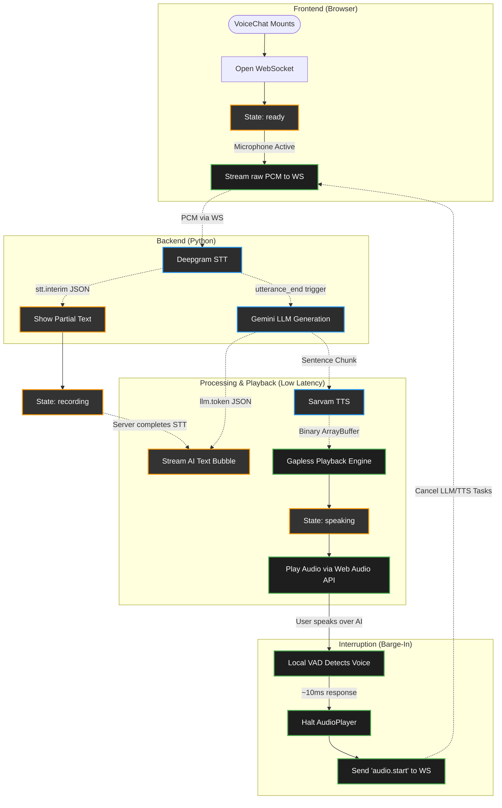

# Frontend Voice Pipeline — Code & Lifecycle Explanation

This document explains exactly how the client-side voice application operates under the **Hybrid Architecture** (Client VAD for Barge-in + Server STT for End-of-Turn).

---

## 1. Frontend Lifecycle & Data Flow

Below is the complete flow of states, user gestures, and background tasks on the client:



---

## 2. Continuous Audio Streaming

Unlike traditional push-to-talk systems that wait for you to finish speaking before uploading a file, this application uses **Continuous Streaming**.

1. **AudioWorklet**: The `vad.worklet` continuously processes microphone input at 16kHz Float32.
2. **Instant Transmission**: Every time an audio frame is processed by the worklet (`onFrameProcessed`), it is instantly converted to a PCM-16 Int16 binary array and sent over the WebSocket.
3. **No Client-Side Cutoffs**: Because audio is continuously streaming to the server, the client never "cuts you off". The server (via Deepgram) determines when you are finished speaking based on intelligent semantic endpointing, allowing for long, natural pauses without breaking the sentence.

---

## 3. The WebSocket Router

The **VoiceChat** controller handles incoming data dynamically using two routes:

### A. Raw Audio Streams (Binary)
If the incoming packet is an `ArrayBuffer`, it represents a chunk of voice response. It is immediately forwarded to the playback engine:
```javascript
playerRef.current.playChunk(event.data);
```

### B. Command Packets (JSON Strings)
If the packet is text, the controller parses it to update the application state:
1.  `"type": "stt.interim"`: Displays real-time partial transcripts (ghost text) as you speak.
2.  `"type": "processing"`: Moves the interface to a loading/thinking state once the server decides your turn is over.
3.  `"type": "stt.result"`: Renders the final user chat bubble.
4.  `"type": "llm.token"`: Appends the streaming tokens from the LLM to the screen.
5.  `"type": "tts.start"`: Swaps the state to `speaking`.
6.  `"type": "tts.done"`: Signals that no more audio packages are coming. Once playback finishes, it returns the interface to `ready`.
7.  `"type": "interrupted"`: Resets the state back to `ready` and clears any partial response buffers.

---

## 4. The Voice Activity Detection (VAD) Pipeline

The system uses `@ricky0123/vad-web` running the **Silero VAD ONNX model** locally in the browser. 

In our **Hybrid Architecture**, the client-side VAD is strictly reserved for **Barge-In (Interruption)**:
1.  **Acoustic Echo Cancellation (AEC)**: Enabled so the speaker output doesn't feed back into the microphone.
2.  **Barge-In**: While the AI is speaking, if the user starts speaking, the VAD instantly fires `onSpeechStart`. This immediately stops the AI's playback, cancels the server's task, and allows the continuous audio stream to be treated as a new user query.
3.  **End-of-Turn Hint**: The VAD still fires `onSpeechEnd`, which sends a lightweight `"speech.end"` hint to the server, but the actual decision to generate a response relies on Deepgram's semantic endpointing.

---

## 5. The Gapless Playback Engine

To stream voice segments dynamically over a network without popping, clicks, or pauses, **AudioPlayer** implements three mechanisms:

### A. Decode-Free Playback
To avoid decompression overhead, the player takes raw binary arrays, casts them back to `Int16Array`, and scales them back into Float32 values.

### B. Pre-Buffering (Absorbing Network Jitter)
The player delays starting playback until it has accumulated at least `MIN_BUFFER_CHUNKS = 2` chunks to absorb network jitter.

### C. Timeline Look-Ahead Scheduling
To chain chunks together perfectly without click gaps, the player uses a floating timeline marker (`nextStartTime`) synced to the hardware audio clock (`audioContext.currentTime`), guaranteeing sample-accurate playback concatenation.
