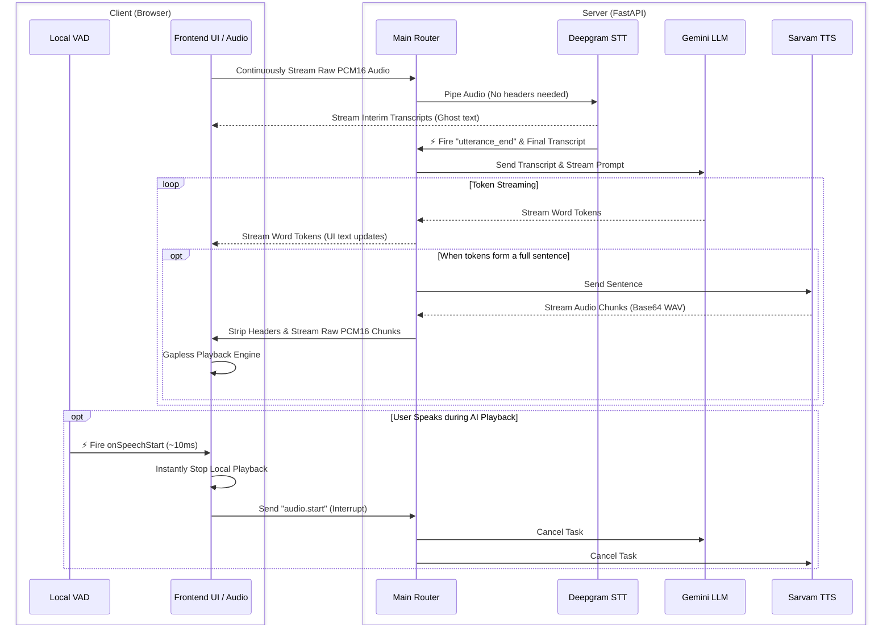
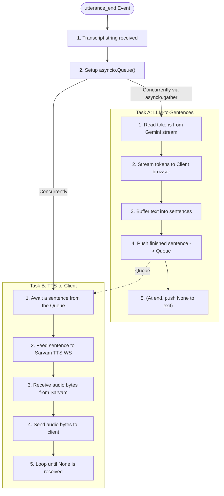

# TTS Speech Engine — System Architecture & Code Walkthrough

Welcome to the documentation for your **TTS Speech Engine**. This guide explains how the system works on a code level in simple, easy-to-understand terms. It covers how the files fit together, the lifecycle of a WebSocket connection, how the individual services function, and how the asynchronous pipeline operates in real time.

---

## 1. System Overview & File Structure

The system is a real-time, two-way conversational voice assistant. At a high level, the flow of a single user turn is:

### The Workspace Directory Structure
The workspace is organized into a client-server architecture:
*   **server/**: The FastAPI application files.
    *   **main.py**: The server entrypoint, WebSocket logic, and pipeline coordinator.
    *   **config.py**: Handles loading environment configurations (API keys, settings).
    *   **utils.py**: Helper utilities for file conversion.
    *   **services/**: Integrations with external AI services.
        *   **stt_deepgram.py**: Speech-to-Text streaming service using Deepgram Nova-3.
        *   **llm.py**: Language model streaming service using Google Gemini.
        *   **tts.py**: Text-to-Speech streaming service using Sarvam AI's WebSockets.

---

## 2. The WebSocket Lifecycle (`main.py`)

A WebSocket connection allows a continuous, two-way (full-duplex) exchange of data between the user's browser and the FastAPI server without opening new HTTP requests for every action. The lifecycle is handled by the **voice_websocket** function.

### A. Connection Establishment
When a client connects to `ws://localhost:8000/ws/voice`:
1.  The connection is accepted (`await ws.accept()`).
2.  The server sets up a clean state for the session:
    *   `conversation_history`: A list storing chat context so Gemini remembers the conversation.
    *   `session_stt`: A dedicated Deepgram WebSocket session for the client.
    *   `pipeline_task`: A placeholder for the background task running the AI pipelines.

### B. Listening for Client Messages
The server enters a continuous loop awaiting incoming messages (`await ws.receive()`). It processes three types of data:
1.  **Binary Data (Raw Audio Frame)**:
    The server forwards the incoming raw PCM byte chunks directly to the Deepgram WebSocket.
2.  **Control Messages (JSON Strings)**:
    *   `"type": "audio.start"`: Triggered by client VAD barge-in. Cancels any currently running LLM/TTS task to instantly stop playback.
    *   `"type": "interrupt"`: Explicit stop command. Cancels the pipeline task immediately.
    *   `"type": "clear_history"`: Resets `conversation_history`.
    *   `"type": "ping"`: Responds with `pong` to keep the connection alive.
3.  **Disconnection**:
    If the websocket disconnects, the loop breaks, the pipeline task is cancelled, and STT/TTS connections are gracefully closed.

---

## 3. How the Services Work

### A. Speech-to-Text (`stt_deepgram.py`)
Implemented in the **DeepgramStreamingSTT** class.
*   **Persistent Connection**: It maintains a persistent WebSocket connection to `wss://api.deepgram.com/v1/listen`.
*   **Audio Streaming**: Receives continuous raw PCM audio from the client and forwards it directly to Deepgram without needing to build WAV headers.
*   **Callbacks**: 
    *   `on_interim_transcript`: Relays partial text to the client so the UI updates as you speak.
    *   `on_final_transcript`: Accumulates the full sentence.
    *   `on_utterance_end`: Deepgram uses semantic endpointing (detecting natural pauses in speech). When this fires, it triggers `run_voice_pipeline()` in `main.py` with the accumulated transcript.

### B. Large Language Model (`llm.py`)
Implemented in the **GeminiLLM** class.
*   The service configures the Google Generative AI SDK using your API key.
*   When a prompt is sent, it appends it to the `conversation_history` list.
*   It calls **`generate_content_async(messages, stream=True)`**. Because `stream=True` is enabled, Google returns the text in small tokens (parts of words) as they are generated, rather than making the server wait for the entire paragraph to finish.

### C. Text-to-Speech (`tts.py`)
Implemented in the **SarvamTTS** class.
*   **WebSocket Streaming**: Synthesizing speech sentence-by-sentence requires a fast, persistent pipeline. This service maintains its own WebSocket connection directly to Sarvam AI (`wss://api.sarvam.ai/text-to-speech/ws`).
*   **Configuring**: Upon connecting, it sends a JSON configuration frame specifying the speaker voice, target language, and output audio codec ("wav").
*   **Feeding Text**: An internal background task listens to incoming sentences and forwards them to Sarvam's WebSocket, immediately followed by a `{"type": "flush"}` command to trigger synthesis without delay.
*   **Stripping Headers**: Sarvam returns base64-encoded WAV segments. The custom **`_strip_wav_header`** helper extracts only the raw PCM-16 audio samples, yielding clean gapless audio chunks to the client.

---

## 4. The Magic: Asynchronous Task Cycle & Concurrency

The voice pipeline is coordinated by the **run_voice_pipeline** function. It is designed to be highly responsive: the user should hear the voice assistant begin speaking the first sentence while the assistant is still generating the rest of the response.

Here is how the asynchronous task cycle accomplishes this:

### 1. The Async Queue (`asyncio.Queue`)
To run speech generation and text generation at the same time, we need a way to pass data between them safely. We use an **`asyncio.Queue`**. Think of the queue as a pipe:
*   **Task A (Producer)** pushes completed sentences into the pipe.
*   **Task B (Consumer)** waits at the other end, takes sentences out as soon as they appear, and converts them to speech.

By calling **`await asyncio.gather(_llm_to_sentences(), _tts_to_client())`**, both loops run concurrently on a single CPU thread, handing off control to each other whenever they perform I/O actions (like waiting for API networks or queue items).

### Handling Interruption (Barge-In)
Because the pipeline runs inside a background task (`pipeline_task`), the main WebSocket loop is never blocked. 

If the client sends an `"audio.start"` (meaning the user barged in and started speaking over the AI), the server instantly calls `pipeline_task.cancel()`, which halts the concurrent LLM and TTS loops and prepares to listen to the new Deepgram stream.
